# Enterprise Ephemeral Test Platform

## Architecture & Design Document

| | |
|---|---|
| **Version** | 1.1 — POC Edition |
| **Scope** | Short-lived ephemeral environments — AWS, GCP, on-prem Kubernetes |
| **Audience** | Platform engineers and application team leads |
| **SVG diagrams** | All in `img/` — open in draw.io, Lucidchart, Confluence, or Inkscape to edit |

> **Part 1 — Architecture only.** Implementation guide published separately.

---

## Table of Contents

- [0. System Context (Level 0)](#0-system-context-level-0)
- [1. Container Diagram (Level 1)](#1-container-diagram-level-1)
- [2. Overview](#2-overview)
- [3. Ephemeral Lifecycle](#3-ephemeral-lifecycle)
- [4. Functional Architecture](#4-functional-architecture)
- [5. ELF Logging](#5-elf-logging)
- [6. Jira Cloud Integration](#6-jira-cloud-integration)
- [7. SonarQube / SonarCloud Integration](#7-sonarqube--sonarcloud-integration)
- [8. Flexible Teardown Architecture](#8-flexible-teardown-architecture)
- [9. Snapshot Management](#9-snapshot-management)
- [Diagram Reference](#diagram-reference)

---

## 0. System Context (Level 0)

> **What this diagram shows:** The platform as a single black box. Every person and external system that interacts with it, and the nature of each relationship. Use this as the opening slide for any new-audience presentation.

### Actors and external systems

| Actor | Type | Relationship |
|---|---|---|
| **Dev / App team** | Person | Writes `env.yaml`, opens pull requests, reads test results on the PR check |
| **Platform team** | Person | Owns, operates, and evolves the platform; manages onboarding and cost governance |
| **Finance / Auditors** | Person | Reads per-team cost reports and the immutable audit trail for compliance evidence |
| **GitHub / GitLab** | External | Source of PR-opened events; receives check results back |
| **AWS / GCP / K8s** | External | Target cloud providers where ephemeral resources are provisioned and destroyed |
| **Vault / Secrets Mgr** | External | Stores all credentials; leases auto-revoked when environments are destroyed |
| **Datadog / Grafana** | External | Receives OpenTelemetry metrics, traces, and logs |
| **Slack / Jira** | External | Receives test-result notifications; Jira tickets auto-created on failure |
| **SonarCloud** | External | Receives code scan results; returns quality gate PASS/FAIL |
| **ELF / Log store** | External | Receives structured logs from every ephemeral environment, indexed per PR |

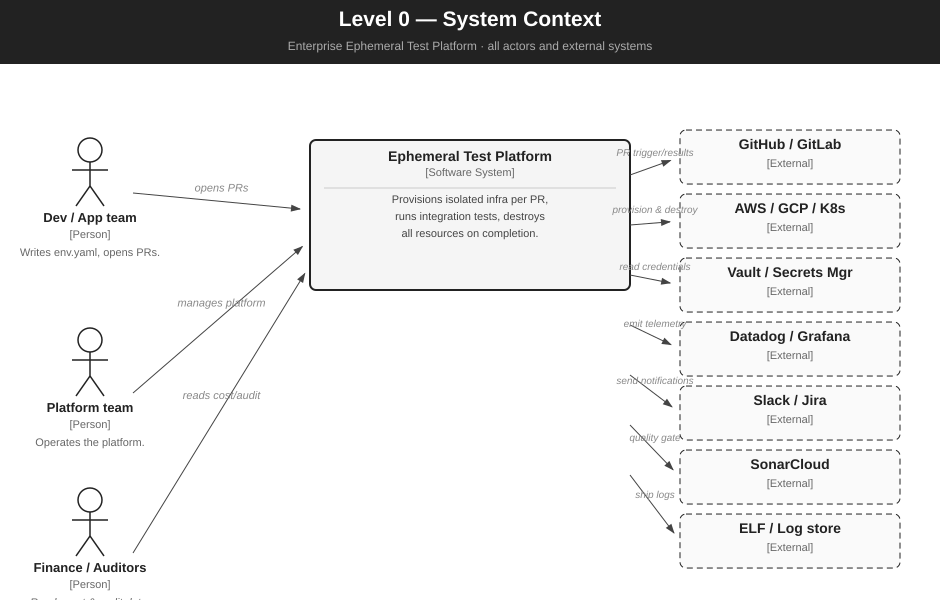

*Figure L0-A — System context: full platform, all actors and external systems*

> **Editable SVG:** `img/diag_l0_platform.svg`

### Key boundary decisions

- The platform is a **single deployable unit** (Docker image) from a consumer perspective.
- The **only inbound trigger** is a PR event — no polling, no always-on webhook server.
- Every external system relationship is **outbound from the platform** after the initial trigger.
- **SonarCloud** and **ELF** are new in v1.1 — quality and observability are first-class citizens, not afterthoughts.

---

## 1. Container Diagram (Level 1)

> **What this diagram shows:** The platform boundary opened up. Every major deployable component with its technology, responsibility, and communication flows. Use this when onboarding a new platform engineer or planning a new feature.

### Component summary

| Component | Technology | Responsibility |
|---|---|---|
| **GitHub Actions Runner** | CI/CD | Triggered by PR. Calls platform Docker image. Posts check results. |
| **Platform CLI** | Java CLI | Wraps orchestrator for local dev. Same `env.yaml` contract, no cloud creds needed. |
| **Self-Service Portal** | Spring Boot + React | Team registration, active env dashboard, cost history, audit log viewer. |
| **REST API** | Spring Boot | Cost aggregations, lifecycle history, audit log for finance and integrations. |
| **Container Registry** | ECR / GCR / Harbor | Shared long-lived registry. All providers pull images tagged `pr-{n}`. |
| **Orchestrator** | platform-core.jar | Drives `provision → seedData → runTests → destroy` in sequence. `destroy()` in `finally`. |
| **Config Parser** | Java — platform-core | Parses `env.yaml` into typed `EnvironmentSpec`. Validates before any cloud resource is touched. |
| **Secret Manager** | Java abstraction | Facade over Vault, AWS SM, GCP SM. Returns `DbCredentials` — no raw passwords. |
| **TTL Watchdog** | @Scheduled bean | Every 5 min. Destroys environments whose `startedAt + ttl < NOW()`. |
| **ELF Log Shipper** | Filebeat / Fluent Bit | Collects container logs from ephemeral environments. Adds env-id, team, pr-number metadata. Ships to central ELF stack. |
| **Sonar Scanner** | Maven plugin / CLI | Runs `sonar:sonar` after compile. Evaluates quality gate. Blocks provision if gate FAILED. |
| **Report Publisher** | Spring + REST | Parses Surefire XML. Posts to GitHub PR check. Alerts Slack. Creates Jira Cloud ticket on failure. |
| **State Store** | PostgreSQL + Redis | Lifecycle event log, Redis pub/sub, TF remote state. |
| **Snapshot Store** | S3 + metadata DB | Named environment snapshots per PR. Manifest includes git SHA, RDS snapshot ARN, S3 clone. |
| **Jira Cloud adapter** | Spring — REST client | Subscribes to lifecycle events. Maps to Jira transitions. Idempotent. |
| **ELF Stack** | Elasticsearch / OpenSearch | Central log store, per-env index, 7-day hot retention, Kibana dashboards. |
| **Teardown Engine** | TeardownStrategy | Four strategies: immediate, scheduled, on-demand, partial. Configurable per team in `env.yaml`. |
| **AWS / GCP / K8s Providers** | ProviderAdapter impls | Cloud-specific Terraform or Helm execution. One workspace / namespace per PR. |

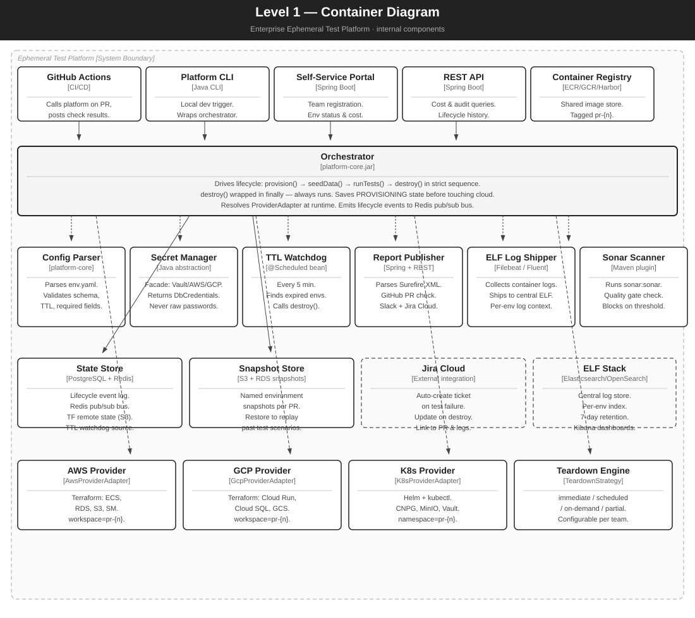

*Figure L1-A — Container diagram: full platform, all internal components and flows*

> **Editable SVG:** `img/diag_l1_platform.svg`

### Critical design rules

- `destroy()` is always in a `finally` block. No exception can bypass it.
- Orchestrator saves `PROVISIONING` **before** calling `provision()`. TTL watchdog recovers within 5 min if CI dies.
- The three ProviderAdapters are separate Maven modules — a bug in one cannot affect the others.
- The **ELF Log Shipper** and **Sonar Scanner** are separate beans registered in the platform, not embedded in application code.
- **Jira Cloud adapter** is event-driven via Redis — it never blocks the lifecycle.

---

## 2. Overview

The ephemeral test platform creates a complete, isolated infrastructure stack when a pull request is opened, runs the integration test suite against real cloud services, and tears everything down when the PR closes or a TTL expires.

Three core principles:

- **Any team, any stack** — a single `env.yaml` is the only contract teams write.
- **Any cloud** — the same `ProviderAdapter` interface works on AWS, GCP, and on-prem Kubernetes.
- **Zero residual cost** — destroy always runs, even when tests fail.

### 2.1 Key design decisions

| Decision | Detail |
|---|---|
| **ProviderAdapter SPI** | Platform core has zero cloud SDK imports. All cloud operations go through four interface methods. |
| **env.yaml contract** | No Terraform, no cloud SDK, no IAM knowledge required from application teams. |
| **Workspace isolation** | `pr-{number}` prefix on every resource name. Zero collisions between concurrent PRs. |
| **Destroy guarantee** | `if: always()` in CI + TTL watchdog as independent safety net. |
| **Quality gate** | SonarCloud gate evaluated before `terraform apply`. Infra cost not incurred for failing code. |
| **Structured logging** | Every log line carries `env-id`, `team`, `pr-number`. ELF index per environment. |
| **Jira integration** | Auto-create ticket on failure, auto-close on destroy. Zero manual steps. |
| **Flexible teardown** | Four strategies configurable per team. Platform-wide TTL cap overrides all. |
| **Snapshot management** | Named snapshots enable exact reproduction of past test scenarios for debugging and compliance. |

---

## 3. Ephemeral Lifecycle

| Stage | Name | What happens |
|---|---|---|
| **1** | Trigger | PR opened. CI reads `env.yaml`, compiles, runs Sonar scan. Quality gate evaluated. If FAILED — stops here, no infra cost. |
| **2** | Provision | `terraform apply workspace=pr-{n}`. VPC, ECS, RDS, S3, SM created. ELF log shipper sidecar started. |
| **3** | Test execution | Flyway migrations → CSV seed → JUnit suite → Sonar coverage upload → report published. |
| **4** | Teardown | Teardown engine applies configured strategy. Snapshot taken if configured. Resources destroyed. Jira ticket updated. |

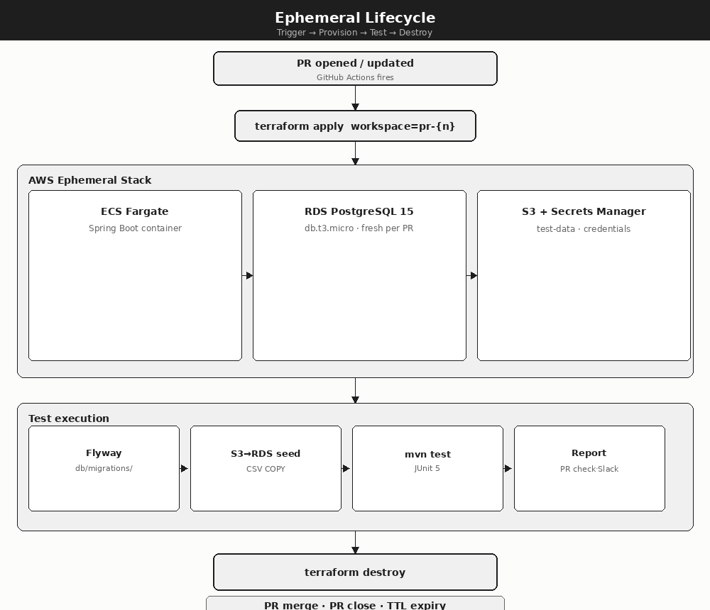

*Figure 1 — Detailed lifecycle: trigger → provision → test execution → teardown*

### 3.1 Lifecycle flowchart

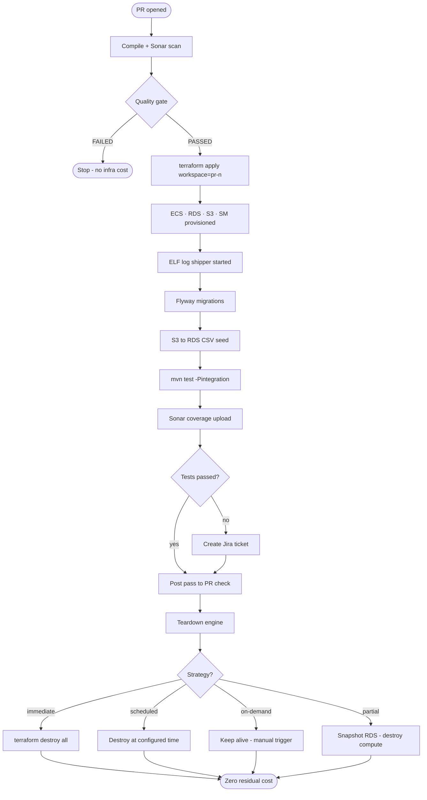

*Diagram 1 — Full lifecycle flowchart including quality gate and teardown strategies*

### 3.2 Component interaction sequence

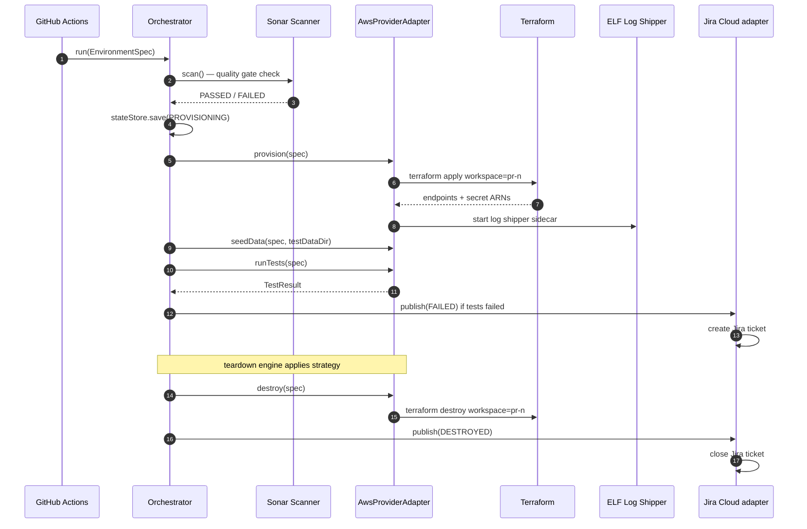

*Diagram 2 — Component interaction sequence including Sonar, ELF, and Jira*

---

## 4. Functional Architecture

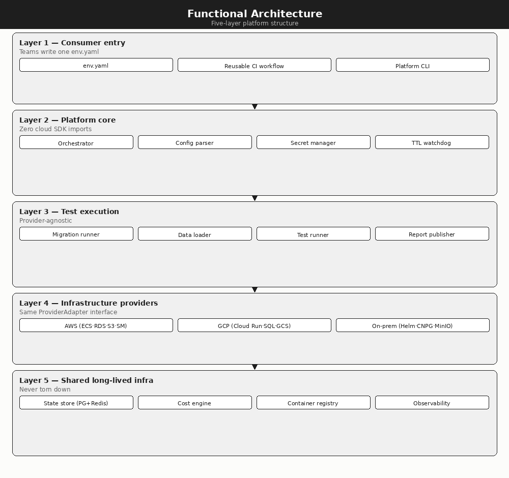

*Figure 2 — Five-layer functional architecture*

### 4.1 Layer summary

| Layer | Components | Description |
|---|---|---|
| **L1 — Consumer entry** | env.yaml · CI workflow · CLI | The only surface teams touch. No platform internals exposed. |
| **L2 — Platform core** | Orchestrator · Config parser · Secret manager · TTL watchdog | Versioned Docker image. Zero cloud SDK imports. Drives full lifecycle. |
| **L3 — Test execution** | Migration runner · Data loader · Sonar scanner · Test runner · ELF shipper · Report publisher | Provider-agnostic. All components work identically on AWS, GCP, on-prem. |
| **L4 — Infrastructure providers** | AWS · GCP · K8s ProviderAdapter impls | Pluggable. Adding a provider = implementing one interface. |
| **L5 — Shared infra** | State store · Snapshot store · Jira adapter · ELF stack · Registry · Observability | Long-lived. Never torn down. |

### 4.2 Functional layers — Mermaid

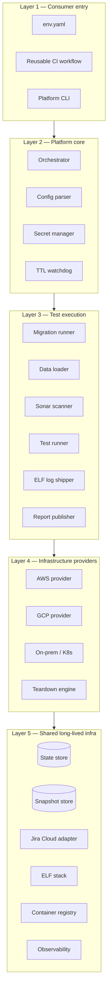

*Diagram 3 — Functional architecture layers*

### 4.3 Provider adapter class structure

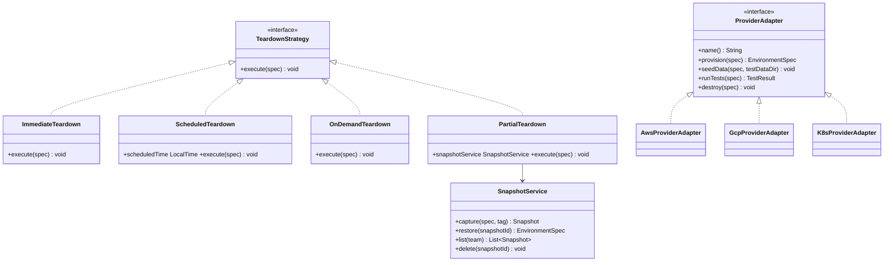

*Diagram 4 — ProviderAdapter SPI, TeardownStrategy SPI, and SnapshotService*

---

## 5. ELF Logging

> ELF (Elasticsearch · Logstash · Filebeat) provides centralised, per-environment structured logging. Every log line carries `env-id`, `team`, and `pr-number` — enabling cross-environment queries and enriching Jira ticket descriptions with direct log links.

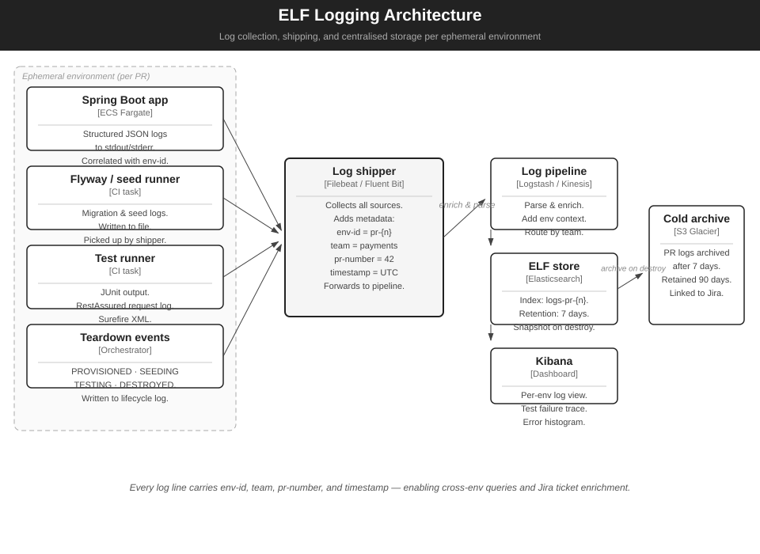

*Figure ELF — Log collection, shipping, enrichment, and centralised storage*

> **Editable SVG:** `img/diag_elf_logging.svg`

### How it works

| Step | Component | Detail |
|---|---|---|
| **Collect** | Filebeat / Fluent Bit sidecar | Runs alongside ECS task and CI runner. Tails stdout, stderr, and log files. |
| **Enrich** | Log shipper | Adds metadata: `env-id=pr-{n}`, `team=payments`, `pr-number=42`, `timestamp=UTC`. |
| **Ship** | Logstash / Kinesis | Parses JSON, routes by team, applies retention rules. |
| **Store** | Elasticsearch / OpenSearch | Index per environment: `logs-pr-{n}`. 7-day hot retention. Snapshots on destroy. |
| **Visualise** | Kibana / OpenSearch Dashboards | Per-env log view, error histogram, test failure trace. |
| **Archive** | S3 Glacier | Log archives after 7 days. Retained 90 days. Linked to Jira ticket. |

### env.yaml logging config

```yaml
logging:
  level: INFO                     # DEBUG for troubleshooting
  format: json                    # structured JSON to stdout
  shipper: filebeat               # filebeat | fluent-bit
  retention_days: 7               # hot retention in ELF
  archive_days: 90                # cold archive in S3
  index_prefix: logs              # index = logs-pr-{n}
```

---

## 6. Jira Cloud Integration

> The Jira Cloud adapter subscribes to platform lifecycle events via Redis pub/sub. It maps each event to a Jira transition, enriches the ticket with log URLs, PR links, cost estimates, and test report links. It is fully asynchronous — Jira latency never blocks the lifecycle.

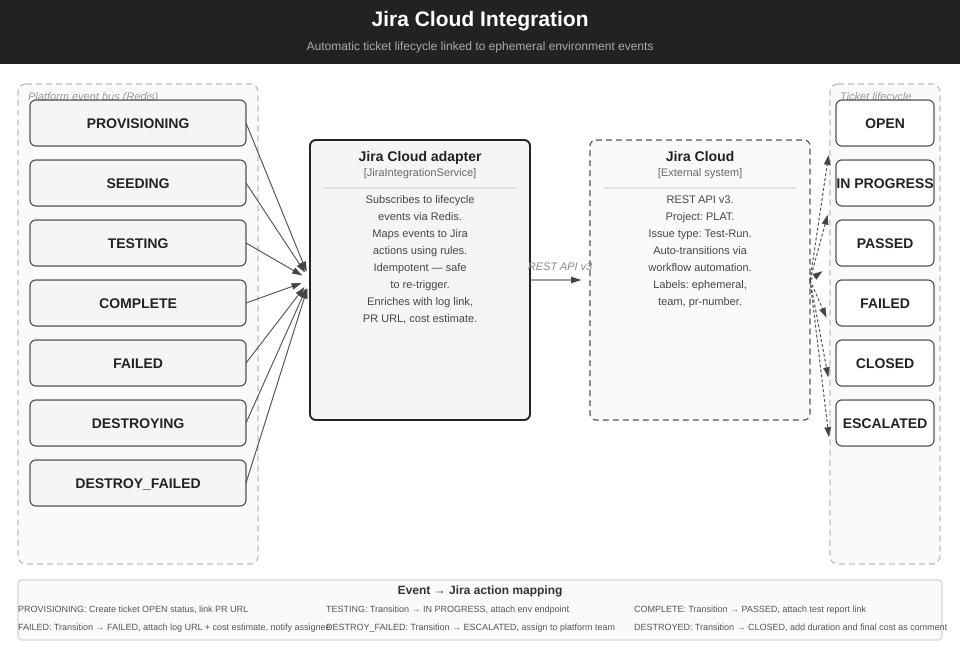

*Figure Jira — Automatic ticket lifecycle linked to environment events*

> **Editable SVG:** `img/diag_jira.svg`

### Event-to-action mapping

| Lifecycle event | Jira action | Ticket fields populated |
|---|---|---|
| `PROVISIONING` | Create ticket, status = **OPEN** | PR URL, team, app, git SHA, env-id |
| `TESTING` | Transition → **IN PROGRESS** | App endpoint URL, estimated cost so far |
| `COMPLETE` | Transition → **PASSED** | Test report link, duration, final cost |
| `FAILED` | Transition → **FAILED** | Log URL (ELF), error summary, cost, assignee notified |
| `DESTROYING` | Add comment | Teardown strategy applied, snapshot taken if configured |
| `DESTROYED` | Transition → **CLOSED** | Final duration, final cost, link to archived logs |
| `DESTROY_FAILED` | Transition → **ESCALATED** | Assign to platform team, alert PagerDuty |

### env.yaml Jira config

```yaml
jira:
  enabled: true
  project: PAY                    # Jira project key
  issue_type: Test-Run
  on_failure:
    assignee: team-lead@company.com
    priority: High
    labels: [ephemeral, automated]
  on_success:
    auto_close: true
```

---

## 7. SonarQube / SonarCloud Integration

> The Sonar scanner runs **before** `terraform apply`. Code quality is evaluated before any cloud cost is incurred. A FAILED quality gate stops the lifecycle immediately — no infrastructure is provisioned, no test data is seeded.

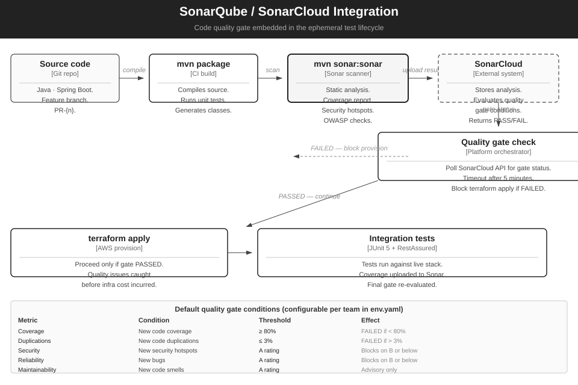

*Figure Sonar — Quality gate embedded in the ephemeral test lifecycle*

> **Editable SVG:** `img/diag_sonar.svg`

### Quality gate conditions (defaults, configurable per team)

| Metric | Condition | Default threshold | Effect on failure |
|---|---|---|---|
| **Coverage** | New code coverage | ≥ 80% | Blocks provision |
| **Duplications** | New code duplication | ≤ 3% | Blocks provision |
| **Security** | New security hotspots | A rating | Blocks provision |
| **Reliability** | New bugs | A rating | Blocks provision |
| **Maintainability** | New code smells | A rating | Advisory — does not block |

### env.yaml Sonar config

```yaml
sonar:
  enabled: true
  host: https://sonarcloud.io
  organisation: my-org
  project_key: payments-service
  quality_gate:
    block_on_fail: true           # set false to warn-only
    timeout_seconds: 300
  coverage_exclusions: "**/generated/**"
```

### Where coverage data flows

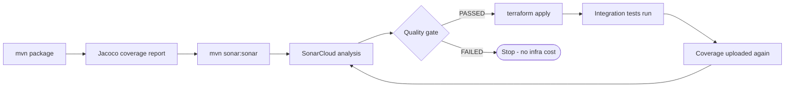

*Diagram 5 — Sonar quality gate flow: pre-provision check and post-test coverage upload*

---

## 8. Flexible Teardown Architecture

> Four teardown strategies are available. Teams configure the strategy in `env.yaml`. A platform-wide TTL cap overrides all strategies — environments cannot survive beyond `max_ttl` regardless of the configured strategy.

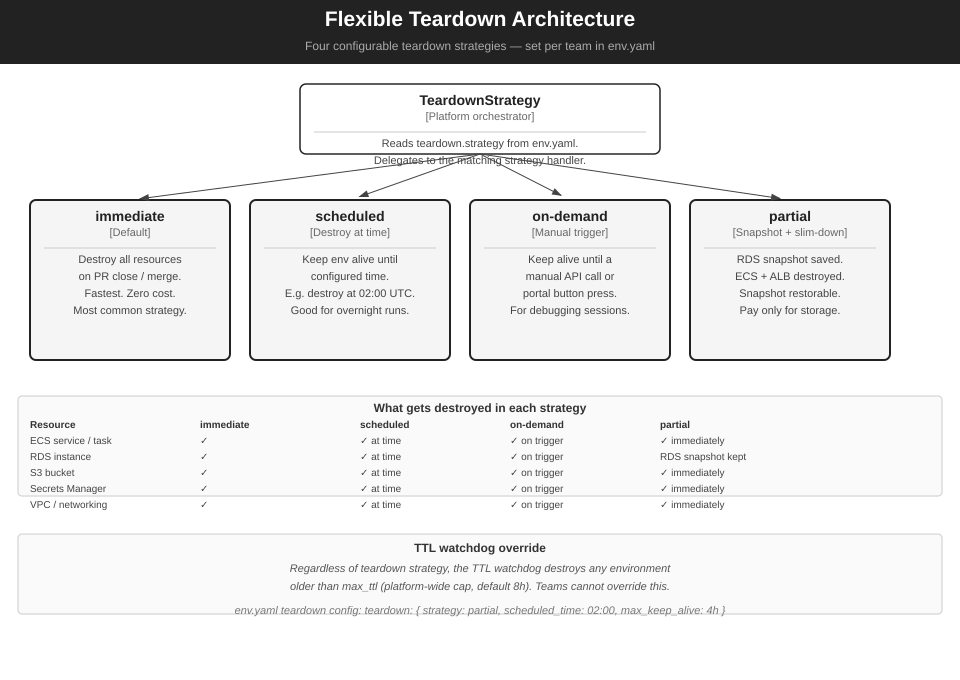

*Figure Teardown — Four configurable teardown strategies*

> **Editable SVG:** `img/diag_teardown.svg`

### Teardown strategies

| Strategy | When to use | What is destroyed | Cost implication |
|---|---|---|---|
| **immediate** | Default. All test runs unless a reason to keep alive. | Everything — ECS, RDS, S3, SM, VPC. | Zero ongoing cost after destroy. |
| **scheduled** | Overnight test suites. Long-running performance tests. | Everything — at a configured UTC time (e.g. `02:00`). | Compute + storage cost until scheduled time. |
| **on-demand** | Active debugging. Reproducing a live failure with a team. | Everything — triggered by a manual API call or portal button. | Compute + storage cost until manually triggered. |
| **partial** | When you need to reproduce the database state later. | ECS, ALB, S3 (after snapshot), SM, VPC. RDS snapshot retained. | Storage cost only (~$0.10/GB/month). |

### Resource destruction matrix

| Resource | immediate | scheduled | on-demand | partial |
|---|---|---|---|---|
| ECS service / task | ✓ immediately | ✓ at time | ✓ on trigger | ✓ immediately |
| RDS instance | ✓ immediately | ✓ at time | ✓ on trigger | RDS snapshot retained |
| S3 bucket | ✓ immediately | ✓ at time | ✓ on trigger | ✓ after S3 clone to snapshot store |
| Secrets Manager | ✓ immediately | ✓ at time | ✓ on trigger | ✓ immediately |
| VPC / networking | ✓ immediately | ✓ at time | ✓ on trigger | ✓ immediately |
| ELF log index | Archived to S3 | Archived at time | Archived on trigger | Archived immediately |

### env.yaml teardown config

```yaml
teardown:
  strategy: partial               # immediate | scheduled | on-demand | partial
  scheduled_time: "02:00"         # UTC — used when strategy=scheduled
  max_keep_alive: 4h              # hard cap for on-demand and partial
  snapshot_on_teardown: true      # always snapshot before destroy
  snapshot_tag: release-1.2       # optional named tag
```

### TTL watchdog interaction

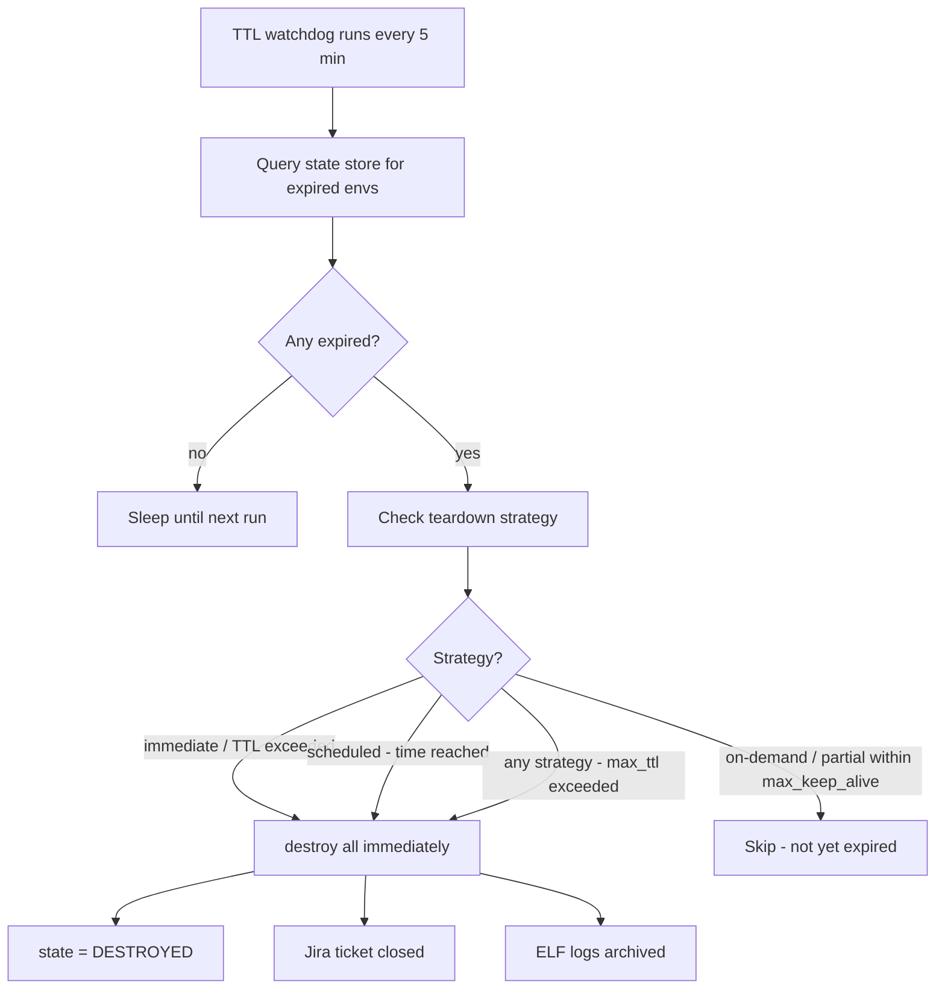

*Diagram 6 — TTL watchdog interaction with teardown strategies*

---

## 9. Snapshot Management

> Snapshots capture the exact state of an ephemeral environment — RDS data, S3 test files, `env.yaml`, and git SHA — and store them for later restoration. A restored environment is indistinguishable from the original. Used for bug reproduction, compliance evidence, and regression baselines.

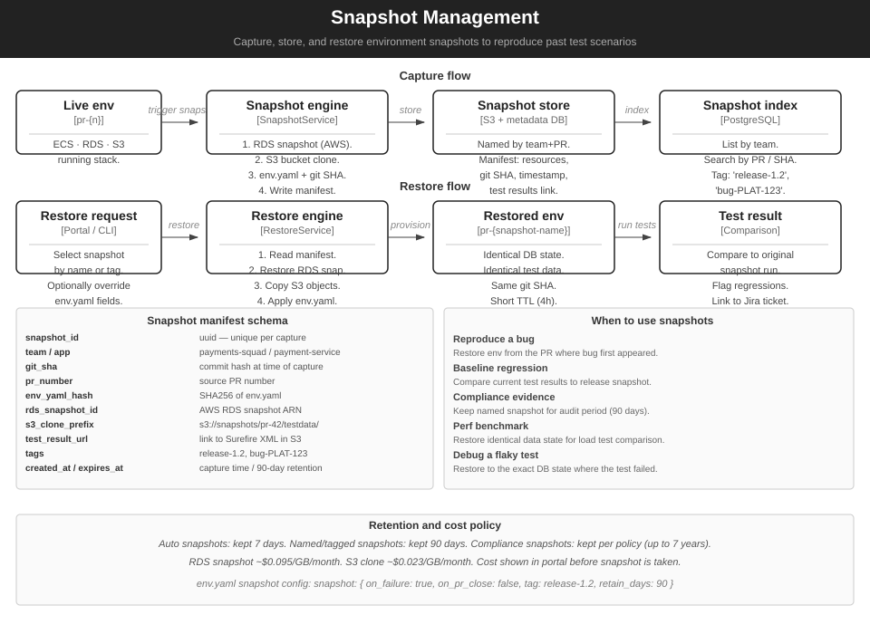

*Figure Snap — Snapshot capture, storage, and restoration lifecycle*

> **Editable SVG:** `img/diag_snapshots.svg`

### Snapshot manifest fields

| Field | Description |
|---|---|
| `snapshot_id` | UUID — unique per capture |
| `team` / `app` | `payments-squad` / `payment-service` |
| `git_sha` | Exact commit hash at time of capture |
| `pr_number` | Source PR number |
| `env_yaml_hash` | SHA-256 of `env.yaml` |
| `rds_snapshot_id` | AWS RDS snapshot ARN |
| `s3_clone_prefix` | `s3://snapshots/pr-42/testdata/` |
| `test_result_url` | Link to Surefire XML in S3 |
| `tags` | `release-1.2`, `bug-PLAT-123` |
| `created_at` / `expires_at` | Capture time / 90-day retention default |

### When to use snapshots

| Scenario | How to use |
|---|---|
| **Reproduce a bug** | Restore the snapshot from the PR where the bug first appeared. Exact same DB state, same test data. |
| **Baseline regression testing** | Compare current test results against a named release snapshot. |
| **Compliance evidence** | Tag a snapshot at release time. Retained for the full audit period. |
| **Performance benchmarking** | Restore an identical data state for load test comparisons across code versions. |
| **Debug a flaky test** | Restore to the exact DB state where the intermittent failure occurred. |

### env.yaml snapshot config

```yaml
snapshot:
  on_failure: true                # auto-snapshot when tests fail
  on_pr_close: false              # snapshot on every PR close
  tag: release-1.2                # named tag (optional)
  retain_days: 90                 # override default 7-day retention
```

### Snapshot state machine

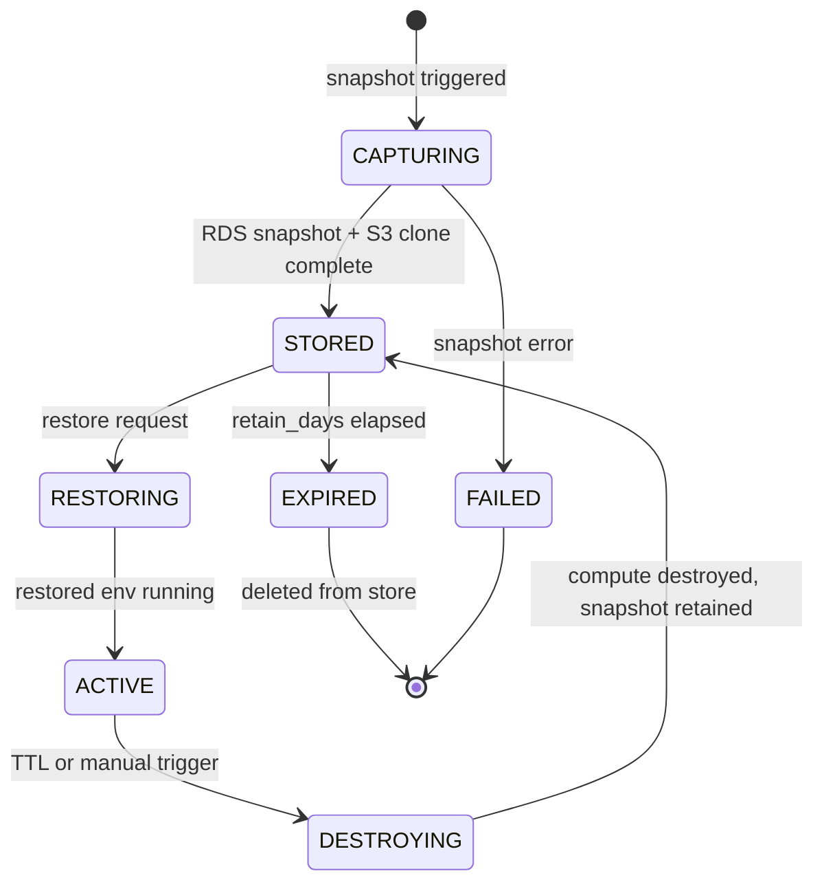

*Diagram 7 — Snapshot lifecycle state machine*

---

## Diagram Reference

| Ref | File | Type | Description |
|---|---|---|---|
| L0-A | `img/diag_l0_platform.svg` | Editable SVG | Full platform system context |
| L1-A | `img/diag_l1_platform.svg` | Editable SVG | Full platform container diagram |
| Fig 1 | `img/fig1_lifecycle.svg` | SVG | Detailed lifecycle diagram |
| Fig 2 | `img/fig2_functional.svg` | SVG | Detailed functional architecture |
| Fig 3 | `img/fig3_springboot.svg` | SVG | Detailed Spring Boot AWS stack |
| ELF | `img/diag_elf_logging.svg` | Editable SVG | ELF logging architecture |
| Jira | `img/diag_jira.svg` | Editable SVG | Jira Cloud integration |
| Sonar | `img/diag_sonar.svg` | Editable SVG | SonarQube / SonarCloud integration |
| Teardown | `img/diag_teardown.svg` | Editable SVG | Flexible teardown strategies |
| Snapshots | `img/diag_snapshots.svg` | Editable SVG | Snapshot management |
| D1 | Section 3.1 | Mermaid | Full lifecycle flowchart |
| D2 | Section 3.2 | Mermaid | Component sequence with Sonar/ELF/Jira |
| D3 | Section 4.2 | Mermaid | Functional architecture layers |
| D4 | Section 4.3 | Mermaid | ProviderAdapter + TeardownStrategy class diagram |
| D5 | Section 7 | Mermaid | Sonar quality gate flow |
| D6 | Section 8 | Mermaid | TTL watchdog + teardown strategies |
| D7 | Section 9 | Mermaid | Snapshot lifecycle state machine |

---

*Enterprise Ephemeral Test Platform — Architecture & Design Document v1.1*
