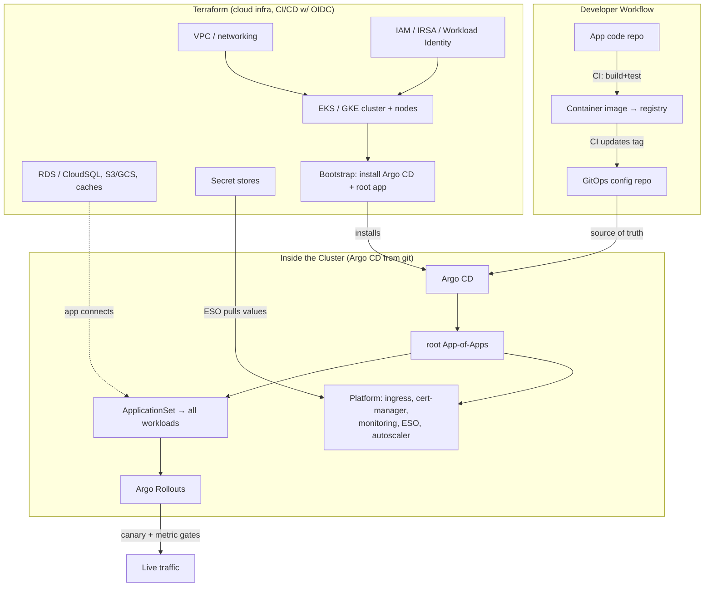

# The Complete Terraform + Argo CD Course
### A Step-by-Step Practical Guide: From Zero to Production GitOps on AWS & GCP

**Format:** Self-paced manual · **Duration:** ~14 weeks (or your pace) · **Prerequisite:** Basic CLI + a little YAML

---

## How to Use This Manual

Every module follows the same structure:

1. **Concept** — what you're learning and why it matters
2. **Problem Statement** — a concrete scenario you'll solve
3. **Solution Walkthrough** — step-by-step, runnable
4. **Exercise** — build it yourself before moving on
5. **Checkpoint** — self-test: "Can I do X?" If not, repeat the module.

**Two clouds, one method.** Every core concept is shown on **AWS and GCP side by side**. Terraform's whole value is that the workflow is identical across clouds — only the resource names change. You'll feel that directly.

**Rules for success:**
- Type the HCL/YAML yourself. Run `plan` before every `apply`. Read the plan.
- Use a **sandbox account/project** with a hard budget alert. Cloud bills are the #1 beginner surprise.
- `terraform destroy` at the end of every session until Module 8 (state/CI). Money.
- Keep one repo (`iac-course/`), one folder per module.
- **Never commit secrets or state files.** We set up `.gitignore` in Module 0 and never look back.

---

## Course Roadmap

| Part | Modules | What You'll Be Able to Do After |
|------|---------|--------------------------------|
| **0. Setup** | 0 | Terraform + AWS + GCP CLIs authenticated; safe sandbox |
| **1. Terraform Foundations** | 1–6 | Providers, resources, variables, state, HCL, data sources |
| **2. Real Infrastructure** | 7–10 | Remote state, modules, workspaces, networking on both clouds |
| **3. Terraform at Scale** | 11–14 | Reusable modules, environments, testing, security scanning, CI |
| **4. Kubernetes + GitOps Foundations** | 15–17 | Provision EKS/GKE with Terraform; Kubernetes basics; install Argo CD |
| **5. Argo CD Deep Dive** | 18–22 | Applications, sync, Helm/Kustomize, ApplicationSets, App-of-Apps |
| **6. Production GitOps** | 23–26 | Multi-cluster, secrets, progressive delivery, RBAC, DR |
| **7. The Boundary** | 27–28 | Terraform vs Argo CD: who owns what; the complete reference architecture |
| **8. Use Case Catalog** | — | 100+ real AWS/GCP + GitOps use cases: problem → solution → build |
| **9. Capstones** | — | 5 portfolio projects + 14-week plan + troubleshooting + glossary |

---

# PART 0 — SETUP

## Module 0: Environment, Accounts & Safety

### Concept
Terraform is a single binary that talks to cloud APIs. You need: the binary, authenticated CLIs for AWS and GCP, and a **sandbox with a budget alarm**. Argo CD comes later (Module 17) once you have a cluster.

### Step-by-Step Setup

**Step 1 — Install Terraform (or OpenTofu, the open-source fork — commands are identical):**
```bash
# macOS
brew install terraform          # or: brew install opentofu
# Linux
# download from developer.hashicorp.com/terraform/downloads, unzip to /usr/local/bin
terraform version               # expect v1.6+  (tofu version for OpenTofu)
```

**Step 2 — Install + authenticate cloud CLIs:**
```bash
# AWS
brew install awscli
aws configure                   # use an IAM user's access keys in your SANDBOX account
aws sts get-caller-identity     # verify: prints your account/user

# GCP
brew install --cask google-cloud-sdk
gcloud auth login
gcloud auth application-default login    # this is what Terraform uses
gcloud config set project YOUR_SANDBOX_PROJECT
gcloud auth application-default print-access-token >/dev/null && echo "GCP ADC ok"
```

**Step 3 — SET A BUDGET ALARM RIGHT NOW (non-negotiable):**
- AWS: Billing → Budgets → create a $20 monthly budget with an email alert at 50%/80%/100%.
- GCP: Billing → Budgets & alerts → $20 budget, alert thresholds.
This one step prevents the classic "I left a NAT gateway / GPU running" horror story.

**Step 4 — Project scaffold + the sacred .gitignore:**
```bash
mkdir iac-course && cd iac-course && git init
cat > .gitignore <<'EOF'
# NEVER commit these
*.tfstate
*.tfstate.*
.terraform/
*.tfvars            # may contain secrets; commit *.tfvars.example instead
crash.log
.terraform.lock.hcl # (opinion: some teams DO commit this; see Module 6)
*.pem
*.json              # careful with GCP key files
EOF
```

**Step 5 — Your first Terraform file (AWS + GCP hello world):**
```hcl
# module0/main.tf
terraform {
  required_version = ">= 1.6"
  required_providers {
    aws    = { source = "hashicorp/aws",    version = "~> 5.0" }
    google = { source = "hashicorp/google", version = "~> 5.0" }
  }
}

provider "aws"    { region = "us-east-1" }
provider "google" { project = "YOUR_SANDBOX_PROJECT", region = "us-central1" }

# Read-only data sources: prove auth works without creating anything
data "aws_caller_identity" "me" {}
data "google_project" "me" {}

output "aws_account"  { value = data.aws_caller_identity.me.account_id }
output "gcp_project"  { value = data.google_project.me.project_id }
```
```bash
cd module0
terraform init      # downloads providers
terraform plan      # should show NO changes (only data sources)
terraform apply      # prints your account/project ids
```

### Checkpoint ✅
- [ ] `terraform version`, `aws sts get-caller-identity`, and GCP ADC all work
- [ ] Budget alarms set on both clouds
- [ ] `terraform apply` printed my AWS account id and GCP project id
- [ ] `.gitignore` excludes state and secrets

---

# PART 1 — TERRAFORM FOUNDATIONS

## Module 1: The Core Loop — Providers, Resources, State

### Concept
Terraform's model in one breath: you **declare desired state** in `.tf` files; Terraform compares it to **recorded state** (`terraform.tfstate`) and the **real world** (via provider APIs), then makes the real world match. Four verbs run your life:

```
terraform init      # download providers, set up backend
terraform plan      # show what WILL change (read-only, always run this)
terraform apply     # make it so (after you read the plan)
terraform destroy   # tear it down
```

The three-way reconciliation is the whole idea:
```
   YOUR .tf FILES  ──►  what you WANT
   STATE FILE      ──►  what Terraform LAST created
   CLOUD APIs      ──►  what ACTUALLY exists
   plan = diff(want, actual); apply = make actual == want; update state
```

### Problem Statement
Create one storage bucket on each cloud, change a setting, and watch how `plan` shows exactly the delta — not a recreate.

### Solution Walkthrough
```hcl
# module1/main.tf  (providers block as in Module 0)
resource "aws_s3_bucket" "demo" {
  bucket = "iac-course-demo-${data.aws_caller_identity.me.account_id}" # globally unique
}
resource "aws_s3_bucket_versioning" "demo" {
  bucket = aws_s3_bucket.demo.id
  versioning_configuration { status = "Enabled" }   # <-- we'll toggle this
}

resource "google_storage_bucket" "demo" {
  name     = "iac-course-demo-${data.google_project.me.project_id}"
  location = "US"
  versioning { enabled = true }                      # <-- and this
}
```
```bash
terraform init && terraform apply
# Now change both versioning to false, then:
terraform plan     # READ IT: shows ~ update in-place on the versioning resources only
terraform apply
```

**What you must internalize here:**
- A `resource` block = one real object. `aws_s3_bucket.demo` is `<type>.<local_name>`; the local name is just your handle in HCL.
- `plan` symbols: `+` create, `-` destroy, `~` update in place, `-/+` **replace** (destroy then create — watch for these, they cause downtime/data loss).
- Terraform figured out the minimal change from the diff. You never wrote "how" — only "what."
- **The state file is precious and often contains secrets.** It's why Module 8 moves it to remote, encrypted, locked storage.

### Exercise
Add a `tags`/`labels` map to each bucket. Plan (should be `~`). Then rename the *bucket name itself* and plan again — observe `-/+` replace, and understand why (name is immutable identity). `destroy` when done.

### Checkpoint ✅
- [ ] I can explain the want/state/actual three-way reconciliation
- [ ] I can read `+ - ~ -/+` in a plan and know which one means downtime

---

## Module 2: Variables, Outputs, and Locals

### Concept
Hardcoding is how you end up with 12 copies of the same file. Terraform's parameterization:
- **`variable`** — inputs (typed, with defaults, validation). Set via `.tfvars`, `-var`, or env `TF_VAR_x`.
- **`output`** — values to surface (IPs, ARNs) and to pass between modules.
- **`local`** — computed/named expressions to DRY up repetition.

### Problem Statement
Parameterize an environment so the same code deploys `dev` and `prod` with different sizes and names, no copy-paste.

### Solution Walkthrough
```hcl
# module2/variables.tf
variable "environment" {
  type = string
  validation {
    condition     = contains(["dev", "staging", "prod"], var.environment)
    error_message = "environment must be dev, staging, or prod."
  }
}
variable "instance_size" {
  type    = map(string)
  default = { dev = "t3.micro", staging = "t3.small", prod = "t3.large" }
}
variable "project_name" { type = string, default = "iac-course" }

# module2/locals.tf
locals {
  name_prefix = "${var.project_name}-${var.environment}"
  common_tags = {
    Project     = var.project_name
    Environment = var.environment
    ManagedBy   = "terraform"
  }
}

# module2/main.tf  (example use)
resource "aws_instance" "app" {
  ami           = data.aws_ami.al2.id
  instance_type = var.instance_size[var.environment]     # size varies by env
  tags          = merge(local.common_tags, { Name = "${local.name_prefix}-app" })
}

# module2/outputs.tf
output "app_public_ip" { value = aws_instance.app.public_ip }
```
```bash
terraform apply -var="environment=dev"
terraform apply -var="environment=prod"    # same code, bigger box, prod naming
```

**Habits that pay off forever:** every resource gets `common_tags`/labels (cost allocation, ownership, automation); a `name_prefix` local kills naming drift; `validation` blocks catch bad inputs at plan time, not 10 minutes into an apply.

### Exercise
Add a `variable "allowed_cidrs" { type = list(string) }` and use it in a security group. Add a validation that rejects `0.0.0.0/0` in prod (hint: combine `var.environment` and `contains`). This is a real security guardrail expressed as code.

### Checkpoint ✅
- [ ] I parameterize by environment with one codebase
- [ ] I use locals for naming + tags, and validation for guardrails

---

## Module 3: HCL You'll Actually Use — Expressions, Loops, Conditionals

### Concept
HCL is declarative but has real expressive power. The pieces you'll reach for daily:
- **`count`** — N copies of a resource (or 0/1 as a toggle).
- **`for_each`** — one resource per map/set key (the *right* way to make collections; stable addressing).
- **`for` expressions** — transform lists/maps.
- **Ternary** — `condition ? a : b`.
- **`dynamic` blocks** — generate repeatable nested blocks (e.g., many ingress rules).

### Problem Statement
Create a set of IAM users (AWS) / service accounts (GCP) from a list, and conditionally create a resource only in prod.

### Solution Walkthrough
```hcl
# for_each: one SA per name — add/remove names without disturbing the others
variable "service_accounts" { type = set(string), default = ["ci", "app", "backup"] }

resource "google_service_account" "sa" {
  for_each     = var.service_accounts
  account_id   = "sa-${each.key}"
  display_name = "Service account for ${each.key}"
}

# count as a toggle: prod-only resource
resource "aws_cloudwatch_log_group" "audit" {
  count             = var.environment == "prod" ? 1 : 0
  name              = "/audit/${local.name_prefix}"
  retention_in_days = 365
}

# for expression: build a map of outputs
output "sa_emails" {
  value = { for k, sa in google_service_account.sa : k => sa.email }
}

# dynamic block: N ingress rules from a variable
variable "ingress_rules" {
  type = list(object({ port = number, cidrs = list(string) }))
  default = [{ port = 443, cidrs = ["10.0.0.0/8"] }, { port = 22, cidrs = ["10.1.0.0/16"] }]
}
resource "aws_security_group" "app" {
  name = "${local.name_prefix}-app"
  dynamic "ingress" {
    for_each = var.ingress_rules
    content {
      from_port   = ingress.value.port
      to_port     = ingress.value.port
      protocol    = "tcp"
      cidr_blocks = ingress.value.cidrs
    }
  }
}
```

**`count` vs `for_each` — the lesson that saves you pain:** `count` indexes by position, so removing the middle item *reindexes and destroys/recreates* everything after it. `for_each` keys by name, so removing one item touches only that one. **Default to `for_each` for collections; use `count` only for a 0/1 toggle.**

### Exercise
Convert a `count`-based list of 3 buckets into `for_each` over a map. Then remove the middle entry from each and compare the plans. Watch `count` reshuffle vs `for_each` surgically remove. This single experiment makes the rule stick.

### Checkpoint ✅
- [ ] I know when to use count vs for_each and can explain the reindex trap
- [ ] I can generate repeated nested blocks with `dynamic`

---

## Module 4: Data Sources & Dependencies

### Concept
**Resources create; data sources read.** Data sources let Terraform reference things it didn't create (an existing VPC, the latest AMI, your account id). Terraform builds a **dependency graph** automatically from references — you rarely need `depends_on`.

### Problem Statement
Launch an instance into an *existing* default VPC using the *latest* Amazon Linux AMI, without hardcoding any IDs.

### Solution Walkthrough
```hcl
# Read the latest AMI (never hardcode AMI ids — they differ per region and rot)
data "aws_ami" "al2023" {
  most_recent = true
  owners      = ["amazon"]
  filter { name = "name", values = ["al2023-ami-*-x86_64"] }
}
data "aws_vpc" "default" { default = true }
data "aws_subnets" "default" {
  filter { name = "vpc-id", values = [data.aws_vpc.default.id] }
}

resource "aws_instance" "app" {
  ami           = data.aws_ami.al2023.id            # implicit dependency
  instance_type = "t3.micro"
  subnet_id     = data.aws_subnets.default.ids[0]
}

# GCP equivalent: latest image + existing network
data "google_compute_image" "debian" {
  family  = "debian-12"
  project = "debian-cloud"
}
data "google_compute_network" "default" { name = "default" }
```

**The dependency graph:** because `aws_instance.app.ami` references `data.aws_ami.al2023.id`, Terraform knows to resolve the AMI first. Order emerges from references, not from you writing steps. Use explicit `depends_on` only for hidden dependencies the graph can't see (e.g., IAM policy must exist before a service that assumes it, when there's no direct attribute reference).

### Exercise
Use a data source to fetch your two most recent AMIs and deploy one instance in each of two AZs (combine `data.aws_subnets` + `count`/`for_each`). `destroy` after.

### Checkpoint ✅
- [ ] I never hardcode AMI/image IDs — I look them up
- [ ] I understand dependencies come from references; I know when `depends_on` is needed

---

## Module 5: Provisioning Compute — The Same Pattern on Both Clouds

### Concept
Now assemble a real (small) system: network + compute + a startup script, on AWS and GCP. The point isn't the specific resources — it's that **the shape is identical** and Terraform makes cross-cloud fluency cheap.

### Problem Statement
Stand up a web server reachable on port 80, with a startup script, on each cloud.

### Solution Walkthrough
```hcl
# ---------- AWS ----------
resource "aws_security_group" "web" {
  name = "${local.name_prefix}-web"
  ingress { from_port=80, to_port=80, protocol="tcp", cidr_blocks=["0.0.0.0/0"] }
  egress  { from_port=0,  to_port=0,  protocol="-1",  cidr_blocks=["0.0.0.0/0"] }
}
resource "aws_instance" "web" {
  ami                    = data.aws_ami.al2023.id
  instance_type          = "t3.micro"
  vpc_security_group_ids = [aws_security_group.web.id]
  user_data = <<-EOF
    #!/bin/bash
    dnf install -y nginx && systemctl enable --now nginx
    echo "hello from $(hostname) on AWS" > /usr/share/nginx/html/index.html
  EOF
  tags = merge(local.common_tags, { Name = "${local.name_prefix}-web" })
}
output "aws_web_url" { value = "http://${aws_instance.web.public_ip}" }

# ---------- GCP ----------
resource "google_compute_firewall" "web" {
  name    = "${local.name_prefix}-web"
  network = "default"
  allow { protocol = "tcp", ports = ["80"] }
  source_ranges = ["0.0.0.0/0"]
}
resource "google_compute_instance" "web" {
  name         = "${local.name_prefix}-web"
  machine_type = "e2-micro"
  zone         = "us-central1-a"
  boot_disk { initialize_params { image = data.google_compute_image.debian.self_link } }
  network_interface {
    network = "default"
    access_config {}                       # ephemeral public IP
  }
  metadata_startup_script = <<-EOF
    #!/bin/bash
    apt-get update && apt-get install -y nginx
    echo "hello from $(hostname) on GCP" > /var/www/html/index.html
  EOF
}
output "gcp_web_url" { value = "http://${google_compute_instance.web.network_interface[0].access_config[0].nat_ip}" }
```
```bash
terraform apply
curl $(terraform output -raw aws_web_url)
curl $(terraform output -raw gcp_web_url)
terraform destroy      # SAME session — don't leave compute running
```

Notice the symmetry: security group ↔ firewall, instance ↔ instance, user_data ↔ metadata_startup_script. Learn the pattern once; the cloud is a detail.

### Exercise
Put the web server behind a load balancer on one cloud (AWS ALB or GCP forwarding rule + backend). This introduces multi-resource wiring — the target group / backend service, listener, and health check. Keep it up for 10 minutes, then destroy.

### Checkpoint ✅
- [ ] I can provision network+compute+startup on both clouds from memory of the pattern
- [ ] I always `destroy` compute I'm experimenting with

---

## Module 6: The Lifecycle, Meta-Arguments & the Lock File

### Concept
Control *how* Terraform manages resources:
- **`lifecycle { create_before_destroy }`** — avoid downtime on replacements.
- **`lifecycle { prevent_destroy }`** — a guardrail on stateful resources (databases!).
- **`lifecycle { ignore_changes = [...] }`** — stop fighting external systems that mutate a field (e.g., autoscaling changing desired count).
- **`.terraform.lock.hcl`** — pins provider versions + hashes for reproducible `init`. Commit it (team consensus) so everyone gets identical providers.

### Problem Statement
Protect a database from accidental destruction and stop Terraform from reverting a field an autoscaler owns.

### Solution Walkthrough
```hcl
resource "aws_db_instance" "main" {
  identifier        = "${local.name_prefix}-db"
  engine            = "postgres"
  instance_class    = "db.t3.micro"
  allocated_storage = 20
  # ... username/password from a secret, never inline

  lifecycle {
    prevent_destroy = true                  # `terraform destroy` will ERROR — on purpose
  }
}

resource "aws_autoscaling_group" "app" {
  desired_capacity = 2
  min_size = 2
  max_size = 10
  lifecycle {
    ignore_changes = [desired_capacity]     # the autoscaler owns this at runtime
  }
}
```

**Real-world wisdom:** `prevent_destroy` on every database, stateful volume, and prod bucket has saved countless careers. `ignore_changes` is how Terraform coexists with autoscalers, external-dns, and consoles that mutate tags. But use `ignore_changes` sparingly — it's a blind spot where drift hides.

### Exercise
Add `create_before_destroy = true` to a launch template + ASG, force a replacement (change the AMI), and observe zero-downtime replacement order in the plan. Then try to `destroy` your `prevent_destroy` database and read the error.

### Checkpoint ✅
- [ ] Every stateful resource I make has `prevent_destroy`
- [ ] I understand what the lock file does and why teams commit it

---

# PART 2 — REAL INFRASTRUCTURE

## Module 7: Remote State & Locking (The First Team Requirement)

### Concept
Local `terraform.tfstate` is fine for solo experiments and catastrophic for teams: no sharing, no locking (two applies corrupt it), no encryption, and it's on your laptop. **Remote state** fixes all four: shared storage, state locking (so only one apply runs at a time), encryption at rest, and versioning for recovery.

Backends:
- **AWS:** S3 (storage + versioning + encryption) with native S3 lockfile locking (modern) or DynamoDB for locking (classic).
- **GCP:** GCS bucket (storage + versioning + encryption); locking is built in.

### Problem Statement
Move your state to a remote, locked, encrypted backend on each cloud — the prerequisite for everything that follows.

### Solution Walkthrough

**The bootstrap chicken-and-egg:** the backend bucket must exist before Terraform can use it. Create it once (by hand or a tiny bootstrap config with *local* state), then everything else uses remote state.

```bash
# AWS bootstrap (one-time, CLI)
aws s3api create-bucket --bucket tfstate-iac-course-$(aws sts get-caller-identity --query Account --output text) --region us-east-1
aws s3api put-bucket-versioning --bucket tfstate-... --versioning-configuration Status=Enabled
aws s3api put-bucket-encryption --bucket tfstate-... \
  --server-side-encryption-configuration '{"Rules":[{"ApplyServerSideEncryptionByDefault":{"SSEAlgorithm":"aws:kms"}}]}'

# GCP bootstrap (one-time)
gcloud storage buckets create gs://tfstate-iac-course-$(gcloud config get-value project) --location=US --uniform-bucket-level-access
gcloud storage buckets update gs://tfstate-... --versioning
```

```hcl
# module7-aws/backend.tf
terraform {
  backend "s3" {
    bucket       = "tfstate-iac-course-123456789012"
    key          = "module7/terraform.tfstate"    # path within the bucket = your state's identity
    region       = "us-east-1"
    encrypt      = true
    use_lockfile = true                            # S3-native locking (TF 1.10+)
  }
}
```
```hcl
# module7-gcp/backend.tf
terraform {
  backend "gcs" {
    bucket = "tfstate-iac-course-your-project"
    prefix = "module7"                             # locking is automatic
  }
}
```
```bash
terraform init   # Terraform detects the backend and offers to migrate local state up. Say yes.
```

**State-splitting strategy (learn this early):** don't put all infrastructure in one giant state — a bad apply can nuke everything, and plans get slow. Split by **blast radius and change cadence**: `networking/`, `data/`, `platform/` (cluster), `apps/`. Each has its own state `key`/`prefix`. Cross-state references use `terraform_remote_state` data sources or (better) published outputs.

### Exercise
Split a two-resource setup into two state files (`network` and `compute`), where compute reads the network's VPC id via `terraform_remote_state`. This is the foundation of every real multi-team layout.

### Checkpoint ✅
- [ ] My state is remote, encrypted, versioned, and locked on both clouds
- [ ] I can articulate a state-splitting strategy by blast radius

---

## Module 8: Modules — Reusable Infrastructure (The Big One)

### Concept
A **module** is a folder of `.tf` files with inputs (variables) and outputs — a reusable building block. Every directory is technically a module; the *root* module calls *child* modules. Modules are how you stop copy-pasting and start composing. This is where Terraform goes from scripting to engineering.

```
root module (your env)
 └── calls module "vpc"      (inputs: cidr, azs → outputs: vpc_id, subnet_ids)
 └── calls module "eks"      (inputs: vpc_id, subnet_ids → outputs: cluster endpoint)
 └── calls module "database" (inputs: subnet_ids → outputs: db endpoint)
```

### Problem Statement
Build a reusable `network` module and instantiate it twice (dev + prod) with different CIDRs — one definition, many environments.

### Solution Walkthrough
```hcl
# modules/network/variables.tf
variable "name"      { type = string }
variable "cidr"      { type = string }
variable "az_count"  { type = number, default = 2 }

# modules/network/main.tf
data "aws_availability_zones" "available" { state = "available" }
resource "aws_vpc" "this" {
  cidr_block           = var.cidr
  enable_dns_hostnames = true
  tags = { Name = var.name }
}
resource "aws_subnet" "public" {
  count             = var.az_count
  vpc_id            = aws_vpc.this.id
  cidr_block        = cidrsubnet(var.cidr, 8, count.index)         # carve /24s
  availability_zone = data.aws_availability_zones.available.names[count.index]
  map_public_ip_on_launch = true
  tags = { Name = "${var.name}-public-${count.index}" }
}
# ... IGW, route table, associations ...

# modules/network/outputs.tf
output "vpc_id"     { value = aws_vpc.this.id }
output "subnet_ids" { value = aws_subnet.public[*].id }
```
```hcl
# environments/dev/main.tf
module "network" {
  source   = "../../modules/network"    # local path; later: a registry or git ref
  name     = "dev"
  cidr     = "10.10.0.0/16"
  az_count = 2
}
output "vpc_id" { value = module.network.vpc_id }

# environments/prod/main.tf  — SAME module, different inputs
module "network" {
  source   = "../../modules/network"
  name     = "prod"
  cidr     = "10.20.0.0/16"
  az_count = 3
}
```

**Module design principles (the craft):**
- **Inputs = what varies; sane defaults for what usually doesn't.** A good module is easy to call correctly.
- **Outputs = everything a caller might wire downstream** (ids, ARNs, endpoints).
- **One module = one logical thing** (a network, a cluster, a service) — not "all our infra."
- **Version modules** when sourced from git/registry (`?ref=v1.2.0`) so environments upgrade deliberately.
- **Don't over-abstract early.** Write it inline twice, extract the module on the third copy. Premature modules are as bad as premature functions.

### Exercise
Convert your Module 5 web-server setup into a `web_server` module with inputs `(name, instance_type, subnet_id)` and output `url`. Instantiate it 3× with `for_each` over a map of environments.

### Checkpoint ✅
- [ ] I can write a module with clean inputs/outputs and call it per environment
- [ ] I know the "rule of three" for when to extract a module

---

## Module 9: Managing Environments — Workspaces vs Directories vs Stacks

### Concept
Three patterns for dev/staging/prod, each with tradeoffs — this is a genuinely contested design decision, so know all three:

| Pattern | How | Pros | Cons |
|---|---|---|---|
| **Workspaces** | `terraform workspace new prod`; same code, separate state per workspace | Zero code duplication | Easy to apply to the wrong env; hard to have per-env differences; discouraged for prod by many teams |
| **Directory per env** | `environments/{dev,prod}/` each calling shared modules | Explicit, per-env overrides easy, hard to fat-finger | Some duplication in the root configs |
| **Tooling (Terragrunt / TF Stacks / Workflows)** | A layer that generates/orchestrates per-env configs (DRY) | DRY + explicit | Extra tool to learn |

**Industry lean:** directory-per-env for clarity and safety (you *see* which env you're in), often with Terragrunt to remove the duplication for larger setups. Workspaces are great for ephemeral/preview environments, less so for long-lived prod.

### Problem Statement
Set up dev + prod with directory-per-env, sharing modules, with prod having stricter settings (multi-AZ, deletion protection).

### Solution Walkthrough
```
environments/
├── dev/
│   ├── backend.tf      # key = "dev/terraform.tfstate"
│   ├── main.tf         # module calls with dev inputs
│   └── terraform.tfvars
├── prod/
│   ├── backend.tf      # key = "prod/terraform.tfstate"   ← SEPARATE state
│   ├── main.tf         # same modules, prod inputs (multi_az=true, prevent_destroy)
│   └── terraform.tfvars
modules/
├── network/
└── database/
```
Each env `cd environments/prod && terraform init && terraform plan`. **Separate state per env is the safety property** — a broken dev apply can't touch prod state.

### Exercise
Add a `staging` env by copying `dev/` and changing the backend key + tfvars. Notice how little changes — that's the payoff of good modules. Add a preview-environment workspace on top of `dev` for a feature branch.

### Checkpoint ✅
- [ ] I can explain the three env patterns and their tradeoffs
- [ ] My envs have separate state and prod has stricter settings

---

## Module 10: Networking Deep Dive (The Foundation Everything Sits On)

### Concept
Networking is where most cloud outages and security incidents originate, and it's the layer you'll `prevent_destroy` and change least. Core objects, AWS ↔ GCP:

| Concept | AWS | GCP |
|---|---|---|
| Virtual network | VPC | VPC network |
| Subnet | Subnet (per-AZ) | Subnetwork (per-region) |
| Public egress | Internet Gateway | Default internet gateway route |
| Private egress | NAT Gateway ($$) | Cloud NAT |
| Firewall | Security Group (stateful) + NACL (stateless) | Firewall rules (stateful) |
| Private service access | VPC Endpoints / PrivateLink | Private Service Connect / Private Google Access |
| Peering | VPC Peering / Transit Gateway | VPC Peering / Network Connectivity Center |

### Problem Statement
Build a production-shaped VPC: public subnets (load balancers), private subnets (apps/DBs), NAT for private egress, on both clouds — as a reusable module.

### Solution Walkthrough (AWS public/private pattern)
```hcl
# modules/vpc/main.tf (essentials)
resource "aws_vpc" "this" { cidr_block = var.cidr, enable_dns_hostnames = true }

resource "aws_subnet" "public" {
  for_each = { for i, az in var.azs : az => i }
  vpc_id, availability_zone = aws_vpc.this.id, each.key
  cidr_block = cidrsubnet(var.cidr, 8, each.value)          # 10.0.0.0/24, .1.0/24...
  map_public_ip_on_launch = true
  tags = { Tier = "public", "kubernetes.io/role/elb" = "1" }   # EKS uses these tags!
}
resource "aws_subnet" "private" {
  for_each = { for i, az in var.azs : az => i }
  vpc_id, availability_zone = aws_vpc.this.id, each.key
  cidr_block = cidrsubnet(var.cidr, 8, each.value + 100)
  tags = { Tier = "private", "kubernetes.io/role/internal-elb" = "1" }
}

resource "aws_internet_gateway" "this" { vpc_id = aws_vpc.this.id }
resource "aws_nat_gateway" "this" {
  for_each      = var.single_nat ? { "0" = values(aws_subnet.public)[0].id } : { for k,s in aws_subnet.public : k => s.id }
  allocation_id = aws_eip.nat[each.key].id
  subnet_id     = each.value
}
# route tables: public → IGW, private → NAT ...
```

**Cost + resilience wisdom baked in:** NAT gateways cost real money per hour + per GB — `var.single_nat` gives you one for dev (cheap, single-AZ risk) and one-per-AZ for prod (resilient, pricier). Private subnets have no public IPs; egress flows through NAT. **The subnet tags matter** — EKS/GKE auto-discover subnets by tag for load balancer placement (foreshadowing Module 15).

### Exercise
Build the GCP twin: VPC network + regional subnetwork + Cloud NAT + Cloud Router + firewall rules allowing internal traffic and denying the rest. Compare the object count to AWS (GCP's regional subnets mean fewer objects).

### Checkpoint ✅
- [ ] I can build a public/private VPC with NAT as a module on both clouds
- [ ] I understand NAT cost tradeoffs and subnet tagging for k8s

---

# PART 3 — TERRAFORM AT SCALE

## Module 11: Production Module Design & Registries

### Concept
At scale, you consume and publish modules deliberately. Sources: local paths (dev), **git refs** (`git::https://...//modules/vpc?ref=v1.4.0`), the **public Terraform Registry** (battle-tested community modules like `terraform-aws-modules/vpc/aws`), and **private registries** (your org's blessed modules).

**Build vs buy:** for standard building blocks (VPC, EKS, RDS), the community registry modules are excellent and save weeks — read their code, pin versions, wrap them thinly for your conventions. Write custom modules for *your* domain patterns, not for re-inventing a VPC.

### Problem Statement
Provision a production VPC + EKS using well-known registry modules, pinned and wrapped with org tags.

### Solution Walkthrough
```hcl
module "vpc" {
  source  = "terraform-aws-modules/vpc/aws"
  version = "~> 5.0"                             # PIN — never float major versions

  name = "${local.name_prefix}-vpc"
  cidr = "10.0.0.0/16"
  azs             = ["us-east-1a", "us-east-1b", "us-east-1c"]
  private_subnets = ["10.0.1.0/24", "10.0.2.0/24", "10.0.3.0/24"]
  public_subnets  = ["10.0.101.0/24", "10.0.102.0/24", "10.0.103.0/24"]
  enable_nat_gateway = true
  single_nat_gateway = var.environment != "prod"    # cheap in dev, resilient in prod
  tags = local.common_tags
}

module "eks" {
  source  = "terraform-aws-modules/eks/aws"
  version = "~> 20.0"
  cluster_name    = "${local.name_prefix}-eks"
  cluster_version = "1.30"
  vpc_id     = module.vpc.vpc_id
  subnet_ids = module.vpc.private_subnets
  eks_managed_node_groups = {
    default = { instance_types = ["t3.large"], min_size = 2, max_size = 6, desired_size = 3 }
  }
  tags = local.common_tags
}
```

**Version pinning is a security and stability control**, not a nicety: an unpinned module can pull breaking changes or (worse) a compromised release into your infra on the next `init`. Pin, review changelogs, upgrade deliberately.

### Exercise
Provision the GCP equivalent with `terraform-google-modules/network/google` and `terraform-google-modules/kubernetes-engine/google`. Note the identical *shape* — call module, pass network to cluster.

### Checkpoint ✅
- [ ] I can compose registry modules and always pin versions
- [ ] I know what to build vs what to consume

---

## Module 12: Testing, Validation & Policy as Code

### Concept
Infra code needs the same quality gates as app code. The layered toolchain:
1. **`terraform fmt`** — formatting (CI-enforced).
2. **`terraform validate`** — syntax + internal consistency.
3. **`tflint`** — provider-aware linting (deprecated args, bad instance types).
4. **`terraform test`** (native, TF 1.6+) — write assertions against plans/applies.
5. **Security scanners** — `tfsec` / `trivy config` / `checkov` catch insecure config (public S3, open SGs, unencrypted disks).
6. **Policy as Code** — OPA/Conftest or Sentinel enforce org rules ("no public buckets", "all resources tagged", "prod only in approved regions") as hard gates.

### Problem Statement
Add a test that proves your VPC module creates the right number of subnets, and a policy that fails any plan containing a `0.0.0.0/0` ingress on port 22.

### Solution Walkthrough
```hcl
# modules/vpc/tests/subnets.tftest.hcl
run "creates_expected_subnets" {
  command = plan
  variables { cidr = "10.0.0.0/16", azs = ["us-east-1a", "us-east-1b"] }
  assert {
    condition     = length(aws_subnet.private) == 2
    error_message = "expected 2 private subnets for 2 AZs"
  }
}
```
```bash
terraform test    # runs .tftest.hcl files
```
```rego
# policy/no_public_ssh.rego  (OPA/Conftest against `terraform show -json` plan)
package terraform.security
deny[msg] {
  r := input.resource_changes[_]
  r.type == "aws_security_group"
  ingress := r.change.after.ingress[_]
  ingress.from_port <= 22
  ingress.to_port   >= 22
  ingress.cidr_blocks[_] == "0.0.0.0/0"
  msg := sprintf("SG %s exposes SSH to the world", [r.address])
}
```
```bash
terraform plan -out=tf.plan && terraform show -json tf.plan > plan.json
conftest test plan.json                 # fails CI if the deny rule matches
tfsec .                                   # or: trivy config .
```

**The gate mindset:** these run in CI on every PR. A plan that violates policy never reaches `apply`. This is how you scale Terraform across many engineers without a senior reviewing every SG rule by hand.

### Exercise
Write a policy requiring every resource to have `Environment` and `Owner` tags, and a `terraform test` that applies your web-server module and asserts the output URL is non-empty (`command = apply` in a sandbox).

### Checkpoint ✅
- [ ] I have fmt/validate/tflint/tfsec + one OPA policy running locally
- [ ] I can write a `terraform test` assertion

---

## Module 13: CI/CD for Terraform (Automated Plan & Apply)

### Concept
Humans running `apply` from laptops is how prod gets 3am surprises. Production Terraform runs in CI/CD with this canonical flow:

```
PR opened ──► fmt + validate + tflint + tfsec + policy ──► terraform plan
          ──► plan posted as a PR comment for review
Merge to main ──► terraform apply (gated: manual approval for prod)
```

Options: GitHub Actions / GitLab CI (DIY, shown below), or managed runners (Terraform Cloud/HCP, Spacelift, Atlantis, env0) that add state, RBAC, drift detection, and policy natively.

### Problem Statement
Wire a GitHub Actions pipeline: plan on PR (comment the diff), apply on merge with prod approval, using OIDC (no long-lived cloud keys in CI).

### Solution Walkthrough
```yaml
# .github/workflows/terraform.yml
name: terraform
on:
  pull_request: { paths: ["environments/**", "modules/**"] }
  push:         { branches: [main] }

permissions:
  id-token: write        # OIDC — CI assumes a cloud role, NO stored secrets
  contents: read
  pull-requests: write   # to comment the plan

jobs:
  plan:
    runs-on: ubuntu-latest
    steps:
      - uses: actions/checkout@v4
      - uses: aws-actions/configure-aws-credentials@v4
        with:
          role-to-assume: arn:aws:iam::123456789012:role/gha-terraform
          aws-region: us-east-1
      - uses: hashicorp/setup-terraform@v3
      - run: terraform -chdir=environments/dev init
      - run: terraform -chdir=environments/dev fmt -check
      - run: terraform -chdir=environments/dev validate
      - run: tfsec environments/dev
      - run: terraform -chdir=environments/dev plan -no-color -out=tf.plan 2>&1 | tee plan.txt
      - uses: actions/github-script@v7      # post plan.txt as a PR comment
        with: { script: 'const fs=require("fs"); github.rest.issues.createComment({...})' }

  apply:
    if: github.ref == 'refs/heads/main'
    needs: plan
    runs-on: ubuntu-latest
    environment: production          # GitHub "environment" = manual approval gate
    steps:
      - uses: actions/checkout@v4
      - uses: aws-actions/configure-aws-credentials@v4
        with: { role-to-assume: arn:aws:iam::...:role/gha-terraform, aws-region: us-east-1 }
      - uses: hashicorp/setup-terraform@v3
      - run: terraform -chdir=environments/prod init
      - run: terraform -chdir=environments/prod apply -auto-approve
```

**Why OIDC matters:** the CI job exchanges a short-lived GitHub token for temporary cloud credentials by assuming an IAM role / workload-identity SA. No access keys stored in CI secrets to leak. This is the modern standard — set it up once (GCP equivalent: Workload Identity Federation).

### Exercise
Add a **drift-detection** scheduled job: nightly `terraform plan -detailed-exitcode`; if it returns 2 (drift), post an alert. Drift = someone changed infra outside Terraform; catching it early is a superpower.

### Checkpoint ✅
- [ ] Plan runs on PRs and comments the diff; apply is gated for prod
- [ ] CI uses OIDC/short-lived creds, not stored keys

---

## Module 14: Secrets, Identity & Least Privilege

### Concept
Two hard rules: **secrets never live in Terraform code or state in plaintext**, and **every identity gets the minimum permissions**. Mechanisms:
- **Secret storage:** AWS Secrets Manager / SSM Parameter Store; GCP Secret Manager. Terraform *references* secrets; it doesn't store them.
- **The state-secrets problem:** if Terraform creates a DB with a password, that password lands in state. Mitigations: generate secrets in the secret manager and have the resource read them; encrypt state (you did, Module 7); lock state access down; or use ephemeral resources (TF 1.10+) that keep values out of state.
- **Identity for workloads:** IAM Roles for Service Accounts (IRSA) on EKS / Workload Identity on GKE — pods assume cloud roles without static keys.

### Problem Statement
Provision an RDS database whose password is generated and stored in Secrets Manager, never appearing in your code, and grant an app pod read access to one secret via IRSA.

### Solution Walkthrough
```hcl
resource "random_password" "db" { length = 32, special = true }

resource "aws_secretsmanager_secret" "db" { name = "${local.name_prefix}/db" }
resource "aws_secretsmanager_secret_version" "db" {
  secret_id     = aws_secretsmanager_secret.db.id
  secret_string = jsonencode({ username = "app", password = random_password.db.result })
}

resource "aws_db_instance" "main" {
  # ... engine, size ...
  username = "app"
  password = random_password.db.result     # in state, but state is encrypted+locked
  lifecycle { prevent_destroy = true }
}

# IRSA: an IAM role a k8s service account can assume (fine-grained, no static keys)
module "irsa" {
  source  = "terraform-aws-modules/iam/aws//modules/iam-role-for-service-accounts-eks"
  role_name = "${local.name_prefix}-app"
  oidc_providers = { main = { provider_arn = module.eks.oidc_provider_arn,
                              namespace_service_accounts = ["default:app"] } }
  role_policy_arns = { read_secret = aws_iam_policy.read_db_secret.arn }
}
```

**Least-privilege discipline:** write policies that name specific resources and actions (`secretsmanager:GetSecretValue` on that one secret ARN), never `"*"`. Start too tight and open up as needed — the opposite of how most people do it, and far safer. GCP twin: Secret Manager + Workload Identity binding a KSA to a GSA with a narrowly-scoped role.

### Exercise
Create an SSM parameter (SecureString) and an IAM policy granting read to exactly that parameter path. Verify a broad `ssm:*` on `*` would fail your Module 12 policy check (add that rule).

### Checkpoint ✅
- [ ] No plaintext secret in my code; state is encrypted+locked
- [ ] I write resource-scoped IAM, and I know IRSA/Workload Identity exists for pods

---

# PART 4 — KUBERNETES + GITOPS FOUNDATIONS

## Module 15: Provisioning Kubernetes with Terraform (EKS & GKE)

### Concept
Terraform provisions the **cluster** (control plane, node pools, networking, IAM); it should *not* manage what runs *inside* the cluster long-term (that's Argo CD's job — Module 27 draws the exact line). This module gets you a working cluster on each cloud.

### Problem Statement
Stand up a production-shaped EKS and GKE cluster with managed node pools, using the VPC modules from Part 2.

### Solution Walkthrough (EKS via registry module + kubeconfig)
```hcl
module "eks" {
  source  = "terraform-aws-modules/eks/aws"
  version = "~> 20.0"
  cluster_name    = "${local.name_prefix}-eks"
  cluster_version = "1.30"
  cluster_endpoint_public_access = true            # lock down / private in real prod

  vpc_id     = module.vpc.vpc_id
  subnet_ids = module.vpc.private_subnets           # nodes in private subnets

  eks_managed_node_groups = {
    system = { instance_types = ["t3.large"], min_size = 2, max_size = 4, desired_size = 2,
               labels = { role = "system" } }
  }
  enable_irsa = true                                # for Module 14 workload identity
  tags = local.common_tags
}

# Wire kubectl/helm/kubernetes providers to the new cluster
data "aws_eks_cluster_auth" "this" { name = module.eks.cluster_name }
provider "kubernetes" {
  host                   = module.eks.cluster_endpoint
  cluster_ca_certificate = base64decode(module.eks.cluster_certificate_authority_data)
  token                  = data.aws_eks_cluster_auth.this.token
}
provider "helm" {
  kubernetes {
    host                   = module.eks.cluster_endpoint
    cluster_ca_certificate = base64decode(module.eks.cluster_certificate_authority_data)
    token                  = data.aws_eks_cluster_auth.this.token
  }
}
```
```bash
terraform apply
aws eks update-kubeconfig --name $(terraform output -raw cluster_name) --region us-east-1
kubectl get nodes      # your nodes appear
```

**GKE twin** (`terraform-google-modules/kubernetes-engine/google`): pass the VPC/subnet, define node pools, enable Workload Identity. Same shape. GKE Autopilot is an even simpler option where Google manages nodes entirely.

**The critical boundary (previewing Module 27):** Terraform makes the cluster and maybe *bootstraps* a couple of platform add-ons (Argo CD itself, cluster-autoscaler, the ingress controller). Everything else — your apps, and ideally most add-ons — is deployed **by Argo CD from git**, not by Terraform. Mixing app deployment into Terraform leads to slow plans and painful coupling.

### Exercise
Add a second, spot/preemptible node group labeled `role=batch` with a taint, so batch workloads schedule there and cost less. Confirm with `kubectl get nodes --show-labels`.

### Checkpoint ✅
- [ ] I can provision EKS and GKE with node pools via Terraform
- [ ] I can state what Terraform owns vs what Argo CD will own

---

## Module 16: Kubernetes Essentials (Just Enough for GitOps)

### Concept
You don't need to be a Kubernetes expert to do GitOps, but you must read and write the core objects, because **GitOps means these YAMLs live in git and Argo CD applies them.**

The objects you'll touch daily:
| Object | What it is |
|---|---|
| **Pod** | Smallest unit: one or more containers. You rarely create these directly. |
| **Deployment** | Manages a replicated, self-healing set of pods; rolling updates. Your bread and butter. |
| **Service** | Stable network endpoint for a set of pods (ClusterIP/LoadBalancer). |
| **Ingress / Gateway** | HTTP routing from outside into services. |
| **ConfigMap / Secret** | Non-secret / secret configuration injected into pods. |
| **Namespace** | Logical partition (per team/env). |
| **HPA** | Horizontal Pod Autoscaler — scale pods on metrics. |

### Problem Statement
Write, by hand, the manifests for a small web app (Deployment + Service + Ingress) — the exact YAML Argo CD will manage in the next modules.

### Solution Walkthrough
```yaml
# k8s/deployment.yaml
apiVersion: apps/v1
kind: Deployment
metadata: { name: web, namespace: demo }
spec:
  replicas: 3
  selector: { matchLabels: { app: web } }
  template:
    metadata: { labels: { app: web } }
    spec:
      containers:
        - name: web
          image: nginx:1.27          # pin tags; :latest is a GitOps anti-pattern
          ports: [{ containerPort: 80 }]
          resources:                  # ALWAYS set requests/limits
            requests: { cpu: "100m", memory: "128Mi" }
            limits:   { cpu: "250m", memory: "256Mi" }
          readinessProbe: { httpGet: { path: /, port: 80 } }
---
# k8s/service.yaml
apiVersion: v1
kind: Service
metadata: { name: web, namespace: demo }
spec:
  selector: { app: web }
  ports: [{ port: 80, targetPort: 80 }]
```
```bash
kubectl create namespace demo
kubectl apply -f k8s/          # do it manually ONCE to understand it...
kubectl get pods -n demo
kubectl delete -f k8s/         # ...then delete. Argo CD will apply these from git next.
```

**GitOps-relevant habits from day one:** pin image tags (never `:latest`), always set resource requests/limits (schedulability + cost), add readiness/liveness probes (self-healing), and keep everything in YAML files in git — no `kubectl edit` in prod. You just wrote the artifacts GitOps automates.

### Exercise
Add an HPA (scale 3→10 on 70% CPU) and a ConfigMap that injects an env var into the deployment. Apply, then `kubectl describe hpa`. Delete when done — Argo CD takes over next.

### Checkpoint ✅
- [ ] I can read/write Deployment, Service, Ingress, ConfigMap YAML
- [ ] I set requests/limits and probes by reflex, and pin image tags

---

## Module 17: GitOps & Installing Argo CD

### Concept
**GitOps = git is the single source of truth for your cluster's desired state, and an agent continuously reconciles the cluster to match git.** The four principles:
1. **Declarative** — the whole system is described in YAML.
2. **Versioned & immutable** — git history is your audit log and rollback mechanism.
3. **Pulled automatically** — an in-cluster agent (Argo CD) pulls and applies; you don't push with `kubectl`.
4. **Continuously reconciled** — drift (someone `kubectl edit`s) is detected and (optionally) auto-corrected.

Why it wins over `kubectl apply` in CI: full audit trail, trivial rollback (`git revert`), no cluster credentials in CI (the agent pulls), and self-healing against drift.

```
       ┌──────────┐   pull    ┌───────────┐  reconcile  ┌──────────┐
 git ──►│ Argo CD  │──────────►│ desired   │────────────►│ cluster  │
 (truth)│ (agent)  │◄──────────│ vs live   │◄────────────│ (live)   │
       └──────────┘   detect drift        sync           └──────────┘
```

### Problem Statement
Install Argo CD onto your EKS/GKE cluster (bootstrapped by Terraform, per the boundary rule) and log into its UI.

### Solution Walkthrough
```hcl
# platform/argocd.tf — Terraform BOOTSTRAPS Argo CD (one of the few in-cluster things TF owns)
resource "kubernetes_namespace" "argocd" { metadata { name = "argocd" } }

resource "helm_release" "argocd" {
  name       = "argocd"
  namespace  = kubernetes_namespace.argocd.metadata[0].name
  repository = "https://argoproj.github.io/argo-helm"
  chart      = "argo-cd"
  version    = "7.7.0"                     # pin
  values = [yamlencode({
    server = { service = { type = "LoadBalancer" } }   # or ingress in real setups
  })]
}
```
```bash
terraform apply
# Get the initial admin password + URL
kubectl -n argocd get secret argocd-initial-admin-secret -o jsonpath='{.data.password}' | base64 -d
kubectl -n argocd get svc argocd-server         # note the LoadBalancer address
# Install the CLI too:
brew install argocd
argocd login <LB-ADDRESS> --username admin --password <the-password>
```

**The bootstrapping paradox, resolved:** Terraform installs Argo CD (because you can't GitOps-install your GitOps tool from an empty cluster). After that, **Argo CD manages everything else, including its own configuration and add-ons, from git** — even upgrades to Argo CD can be handed to Argo CD (app-of-apps, Module 22). Terraform's in-cluster footprint stays tiny and stable.

### Exercise
Log into the UI, explore the (empty) Applications view, and change the admin password. Then install the Argo CD CLI and run `argocd app list` (empty for now). Next module fills it.

### Checkpoint ✅
- [ ] Argo CD is running, bootstrapped by Terraform
- [ ] I can log into the UI and CLI, and I understand the four GitOps principles

---

# PART 5 — ARGO CD DEEP DIVE

## Module 18: Your First Application — The Core Object

### Concept
The **Application** is Argo CD's fundamental unit: it maps a **source** (git repo + path + revision) to a **destination** (cluster + namespace), and keeps them in sync. Everything else in Argo CD builds on this.

```yaml
apiVersion: argoproj.io/v1alpha1
kind: Application
spec:
  source:      { repoURL, path, targetRevision }   # WHERE the manifests are
  destination: { server, namespace }                # WHERE to deploy them
  syncPolicy:  { ... }                              # HOW to sync (manual/auto)
```

### Problem Statement
Put your Module 16 manifests in a git repo and have Argo CD deploy and continuously reconcile them.

### Solution Walkthrough
```
# git repo layout (this repo IS your source of truth)
gitops-apps/
└── web/
    ├── deployment.yaml
    ├── service.yaml
    └── namespace.yaml
```
```yaml
# argocd/web-app.yaml
apiVersion: argoproj.io/v1alpha1
kind: Application
metadata:
  name: web
  namespace: argocd
spec:
  project: default
  source:
    repoURL: https://github.com/you/gitops-apps.git
    path: web
    targetRevision: main                 # a branch, tag, or commit SHA
  destination:
    server: https://kubernetes.default.svc      # the local cluster
    namespace: demo
  syncPolicy:
    automated: { prune: true, selfHeal: true }   # ← GitOps superpowers, see below
    syncOptions: [CreateNamespace=true]
```
```bash
kubectl apply -f argocd/web-app.yaml            # register the app (this is the ONE kubectl)
argocd app get web
argocd app sync web                              # or it auto-syncs; watch it converge
kubectl get pods -n demo                         # deployed by Argo CD, from git
```

**Understand these two flags deeply — they define GitOps behavior:**
- **`selfHeal: true`** — if someone `kubectl edit`s a live resource, Argo CD reverts it to match git. Git wins, always. Drift is impossible.
- **`prune: true`** — if you *delete* a manifest from git, Argo CD deletes the live resource. Git is complete truth. (Powerful and slightly scary — prune is why you review git diffs carefully.)

Now the loop is closed: **you change infra by committing to git, not by touching the cluster.** Try it — edit `replicas: 3 → 5` in git, push, and watch Argo CD scale the deployment with no `kubectl`.

### Exercise
Trigger a rollback the GitOps way: change the image tag in git (push), watch Argo CD roll it out, then `git revert` the commit and watch Argo CD roll back. Then `kubectl scale` the deployment manually and watch `selfHeal` undo you within seconds.

### Checkpoint ✅
- [ ] I have an Application syncing from git with auto-sync, prune, self-heal
- [ ] I can explain what prune and selfHeal do, and I've seen self-heal revert a manual change

---

## Module 19: Sync Strategies, Health, Hooks & Rollbacks

### Concept
Production sync is more than "apply YAML." Argo CD gives you:
- **Sync waves** (`argocd.argoproj.io/sync-wave` annotation) — order resource application (CRDs before CRs, DB migration before app).
- **Sync hooks** (`PreSync`, `Sync`, `PostSync`) — run Jobs at phases (run migrations PreSync, smoke tests PostSync).
- **Health assessment** — Argo CD knows if a Deployment is actually healthy (not just applied); custom health checks for CRDs.
- **Sync options** — `CreateNamespace`, `ServerSideApply`, `ApplyOutOfSyncOnly`, retry with backoff.
- **History & rollback** — every sync is a revision; `argocd app rollback` or `git revert`.

### Problem Statement
Deploy an app that must run a database migration *before* the new version starts, and verify health before declaring success.

### Solution Walkthrough
```yaml
# a migration Job that runs BEFORE the app syncs, and is cleaned up after success
apiVersion: batch/v1
kind: Job
metadata:
  name: db-migrate
  annotations:
    argocd.argoproj.io/hook: PreSync                          # run before the sync
    argocd.argoproj.io/hook-delete-policy: HookSucceeded      # clean up on success
spec:
  template:
    spec:
      containers: [{ name: migrate, image: myapp:1.4, command: ["./migrate.sh"] }]
      restartPolicy: Never
---
# order resources within a sync with waves
apiVersion: v1
kind: ConfigMap
metadata:
  name: app-config
  annotations: { argocd.argoproj.io/sync-wave: "-1" }         # applied before wave 0
```
```bash
argocd app history web                # list past syncs (revisions)
argocd app rollback web <revision>    # instant rollback to a known-good state
```

**Production patterns baked in:** PreSync hooks for migrations/backups; PostSync hooks for smoke tests that *fail the sync* if the app is broken; sync waves to sequence a multi-component release; health gates so "synced" means "actually working." A failed PostSync test leaves the app OutOfSync and pages you — far better than silently shipping a broken deploy.

### Exercise
Add a PostSync hook Job that curls the app's health endpoint and exits non-zero on failure. Break the app (bad image tag) and watch the sync fail at the health gate rather than declaring success.

### Checkpoint ✅
- [ ] I can order a release with sync waves and run migrations via PreSync hooks
- [ ] I can roll back via CLI and via git revert

---

## Module 20: Helm & Kustomize with Argo CD

### Concept
Raw YAML doesn't scale across environments (dev/staging/prod differ). Two templating approaches, both first-class in Argo CD:
- **Helm** — templated charts with `values.yaml` per environment. Huge ecosystem of community charts. Argo CD renders the chart and applies the output.
- **Kustomize** — overlay-based (a `base/` + per-env `overlays/` that patch it). No templating language; just declarative patches. Kubernetes-native.

Neither is "better" — Helm for packaged/third-party apps and heavy parameterization; Kustomize for your own apps with environment overlays. Many orgs use both.

### Problem Statement
Deploy the same app to dev and prod with different replica counts and resource limits — once with Helm values, once with Kustomize overlays.

### Solution Walkthrough (Kustomize overlays — the GitOps-idiomatic choice)
```
gitops-apps/web/
├── base/
│   ├── kustomization.yaml        # resources: deployment.yaml, service.yaml
│   ├── deployment.yaml           # replicas: 1 (base default)
│   └── service.yaml
└── overlays/
    ├── dev/
    │   └── kustomization.yaml     # patches: replicas 1, small limits
    └── prod/
        └── kustomization.yaml     # patches: replicas 5, big limits, PDB
```
```yaml
# overlays/prod/kustomization.yaml
resources: [../../base]
patches:
  - target: { kind: Deployment, name: web }
    patch: |
      - { op: replace, path: /spec/replicas, value: 5 }
```
```yaml
# Two Applications, same base, different overlay paths:
# argocd/web-dev.yaml  → source.path: web/overlays/dev  → destination.namespace: dev
# argocd/web-prod.yaml → source.path: web/overlays/prod → destination.namespace: prod
```

**Helm variant:** `source: { repoURL, path: charts/web, helm: { valueFiles: ["values-prod.yaml"] } }`. Argo CD renders it. For third-party apps, point `source` at the upstream chart repo + your values.

**The environment-promotion pattern:** the same base flows dev → staging → prod, differing only by overlay/values. Promotion = updating the image tag in the next environment's overlay (often automated, Module 25). One source of truth, environment-specific rendering.

### Exercise
Take a public Helm chart (e.g., `podinfo`) and deploy it via an Argo CD Application with your own `values.yaml` overriding the replica count and adding an ingress. Then do the same app with a Kustomize base+overlay and compare which you prefer.

### Checkpoint ✅
- [ ] I can deploy an app with both Helm values and Kustomize overlays via Argo CD
- [ ] I understand the base→overlay promotion pattern

---

## Module 21: ApplicationSets — Scaling to Many Apps & Clusters

### Concept
Managing 50 apps × 3 environments × 4 clusters by hand-writing 600 Application YAMLs is madness. **ApplicationSet** generates Applications from a template + a **generator**:
- **List generator** — a static list of parameters.
- **Git generator** — one Application per directory/file in a repo (add a folder → get an app automatically).
- **Cluster generator** — one Application per registered cluster (deploy an add-on to every cluster).
- **Matrix / merge** — combine generators (every app × every cluster).

### Problem Statement
Automatically create an Application for every subdirectory under `apps/` in your repo, so onboarding a new app = adding a folder.

### Solution Walkthrough
```yaml
apiVersion: argoproj.io/v1alpha1
kind: ApplicationSet
metadata: { name: all-apps, namespace: argocd }
spec:
  generators:
    - git:
        repoURL: https://github.com/you/gitops-apps.git
        revision: main
        directories: [{ path: "apps/*" }]         # one app per folder under apps/
  template:
    metadata: { name: "{{path.basename}}" }
    spec:
      project: default
      source:
        repoURL: https://github.com/you/gitops-apps.git
        targetRevision: main
        path: "{{path}}"
      destination: { server: https://kubernetes.default.svc, namespace: "{{path.basename}}" }
      syncPolicy: { automated: { prune: true, selfHeal: true }, syncOptions: [CreateNamespace=true] }
```
Now `git add apps/newservice/` → Argo CD creates and syncs the `newservice` Application automatically. Self-service deployment, no Argo CD config changes.

**Cluster generator for platform add-ons:** one ApplicationSet deploys (say) the monitoring stack to *every* registered cluster; register a new cluster and it gets the add-on automatically. This is how platform teams manage fleets.

### Exercise
Create a **cluster generator** ApplicationSet that would deploy a `namespace + network-policy` baseline to every cluster. Test with your single cluster; understand how adding a cluster would fan it out.

### Checkpoint ✅
- [ ] Adding a folder to git auto-creates an Argo CD app (git generator)
- [ ] I understand how cluster/matrix generators scale to fleets

---

## Module 22: App-of-Apps & Bootstrapping the Whole Platform

### Concept
The **App-of-Apps** pattern: one root Application whose manifests are *other Applications* (or ApplicationSets). Sync the root, and it cascades to deploy your entire platform — ingress controller, cert-manager, monitoring, external-secrets, and all your workloads — in the right order (via sync waves). This is how you bootstrap a cluster from near-empty to fully-configured with a single commit.

```
root App ──► platform ApplicationSet ──► [ingress, cert-manager, monitoring, ...]
        └──► apps ApplicationSet     ──► [service-a, service-b, ...]
```

### Problem Statement
Create a root app that deploys a small platform (ingress controller + cert-manager) and your apps ApplicationSet — the entire cluster config from one entrypoint.

### Solution Walkthrough
```
gitops-platform/
├── root.yaml                    # the App-of-Apps root
├── platform/
│   ├── ingress-nginx.yaml       # Application (Helm chart)
│   ├── cert-manager.yaml        # Application (Helm chart), sync-wave "0"
│   └── monitoring.yaml          # Application (kube-prometheus-stack)
└── apps/
    └── all-apps.yaml            # the ApplicationSet from Module 21
```
```yaml
# root.yaml — points Argo CD at the folder full of Applications
apiVersion: argoproj.io/v1alpha1
kind: Application
metadata: { name: root, namespace: argocd }
spec:
  project: default
  source:
    repoURL: https://github.com/you/gitops-platform.git
    path: .                       # render every Application/ApplicationSet here
    targetRevision: main
    directory: { recurse: true }
  destination: { server: https://kubernetes.default.svc, namespace: argocd }
  syncPolicy: { automated: { prune: true, selfHeal: true } }
```
```bash
kubectl apply -f root.yaml       # the LAST kubectl you run — everything else cascades from git
```

**The payoff — the full bootstrap sequence:** Terraform creates the cluster + installs Argo CD + applies `root.yaml`. From that instant, **the entire platform and all apps converge from git automatically**, in dependency order via sync waves. A brand-new cluster becomes production-ready with no manual steps beyond `terraform apply`. Rebuild a cluster? Same commit, same result. This is the endgame of the whole course.

### Exercise
Build a root app that deploys ingress-nginx (wave -1) and a demo app that needs it (wave 0). Sync the root and watch the ordered cascade. Then delete a child Application's manifest from git and watch prune remove it.

### Checkpoint ✅
- [ ] One `kubectl apply -f root.yaml` bootstraps my whole platform from git
- [ ] I can sequence platform components with sync waves

---

# PART 6 — PRODUCTION GITOPS

## Module 23: Multi-Cluster & Multi-Tenancy

### Concept
Real orgs run many clusters (dev/staging/prod × regions × teams). Argo CD manages them from one control plane:
- **Register clusters:** `argocd cluster add <context>` creates a Secret Argo CD uses to reach each cluster.
- **Projects (AppProject):** the multi-tenancy boundary — restrict which repos, clusters, namespaces, and resource kinds a set of apps may use. Team A's project can't deploy to Team B's namespaces.
- **Topologies:** one central Argo CD managing all clusters (simple, single blast radius) vs Argo CD per cluster (isolation, more overhead) vs hub-and-spoke.

### Problem Statement
Add a second cluster and an AppProject that confines a team to their repo, their namespaces, and non-privileged resources.

### Solution Walkthrough
```bash
argocd cluster add prod-eks-context --name prod-eks     # register a target cluster
```
```yaml
# an AppProject = guardrails for a team/tenant
apiVersion: argoproj.io/v1alpha1
kind: AppProject
metadata: { name: team-payments, namespace: argocd }
spec:
  description: Payments team
  sourceRepos: ["https://github.com/you/payments-*"]        # only their repos
  destinations:
    - { server: "*", namespace: "payments-*" }               # only their namespaces
  clusterResourceWhitelist: []                                # NO cluster-scoped resources
  namespaceResourceBlacklist:
    - { group: "", kind: "ResourceQuota" }                    # can't self-raise quotas
  roles:
    - name: developer
      policies: ["p, proj:team-payments:developer, applications, sync, team-payments/*, allow"]
```
Apps in this project reference `project: team-payments` and are then confined to those guardrails. Try to point one at another team's namespace — Argo CD refuses.

**Multi-tenancy is a security control:** Projects prevent one team's Argo CD apps from stomping another's or escalating privileges. Combine with per-cluster RBAC and namespace ResourceQuotas (deployed via GitOps) for defense in depth.

### Exercise
Create two AppProjects (`team-a`, `team-b`), each confined to its namespace prefix, and prove that an Application in `team-a` cannot sync into `team-b`'s namespace (Argo CD blocks it with a clear error).

### Checkpoint ✅
- [ ] I can register multiple clusters and target them from one Argo CD
- [ ] I use AppProjects to confine tenants to their repos/namespaces/resources

---

## Module 24: Secrets in GitOps (The Hard Problem)

### Concept
GitOps says "everything in git," but **you can't commit plaintext secrets.** Three production-grade solutions:
1. **External Secrets Operator (ESO)** — you commit an `ExternalSecret` (a *reference*); ESO fetches the real value from AWS Secrets Manager / GCP Secret Manager / Vault and creates the k8s Secret. Secrets live in the cloud secret store; git holds only pointers. **Most common modern choice.**
2. **Sealed Secrets** — encrypt secrets with a cluster-specific public key; commit the encrypted `SealedSecret`; only the in-cluster controller can decrypt. Git holds ciphertext.
3. **SOPS + age/KMS** — encrypt values in-file; a plugin decrypts at sync time.

### Problem Statement
Give a pod a database password via GitOps, with the real secret stored in AWS Secrets Manager / GCP Secret Manager and only a reference in git.

### Solution Walkthrough (External Secrets Operator)
```yaml
# 1) Install ESO (as an Argo CD Application — it's just another platform add-on)
# 2) A SecretStore telling ESO where the real secrets live (uses IRSA/Workload Identity — Module 14)
apiVersion: external-secrets.io/v1beta1
kind: SecretStore
metadata: { name: aws-sm, namespace: payments }
spec:
  provider:
    aws: { service: SecretsManager, region: us-east-1,
           auth: { jwt: { serviceAccountRef: { name: eso-sa } } } }   # IRSA, no static keys
---
# 3) The ExternalSecret — THIS is what you commit to git (a reference, not a secret)
apiVersion: external-secrets.io/v1beta1
kind: ExternalSecret
metadata: { name: db-credentials, namespace: payments }
spec:
  secretStoreRef: { name: aws-sm, kind: SecretStore }
  target: { name: db-credentials }                    # ESO creates this k8s Secret
  data:
    - secretKey: password
      remoteRef: { key: payments/db, property: password }   # pulled from Secrets Manager
```
Now the k8s `Secret` exists in the cluster (created by ESO), your pod mounts it normally, and **git never saw the password** — only the reference. Rotating the secret in Secrets Manager propagates automatically.

**Why ESO usually wins:** secrets stay in your existing cloud secret manager (audited, rotated, IAM-controlled — the Module 14 work is reused), git stays clean, and there's no cluster-specific encryption key to manage (unlike Sealed Secrets). Sealed Secrets is simpler for small setups; ESO scales to enterprises.

### Exercise
Store a secret in your cloud secret manager, commit only an `ExternalSecret` referencing it, sync via Argo CD, and confirm the pod gets the value while git contains no plaintext. Then rotate the value in the cloud and watch it propagate.

### Checkpoint ✅
- [ ] I can deliver secrets via GitOps with only references in git
- [ ] I can explain ESO vs Sealed Secrets vs SOPS and when to use each

---

## Module 25: Progressive Delivery (Canary & Blue-Green)

### Concept
Rolling updates are all-or-nothing per pod. **Progressive delivery** shifts traffic gradually and rolls back automatically on bad metrics. **Argo Rollouts** (sibling project) replaces `Deployment` with a `Rollout` resource supporting:
- **Canary** — send 5% → 25% → 50% → 100% of traffic to the new version, pausing to analyze metrics between steps.
- **Blue-Green** — stand up the new version fully, test it, then flip traffic instantly.
- **Automated analysis** — query Prometheus/CloudWatch; if error rate or latency exceeds thresholds, **auto-rollback**.

### Problem Statement
Deploy a service as a canary: 20% traffic to the new version, check its error rate against Prometheus, promote if healthy, auto-rollback if not.

### Solution Walkthrough
```yaml
apiVersion: argoproj.io/v1alpha1
kind: Rollout
metadata: { name: web, namespace: demo }
spec:
  replicas: 5
  strategy:
    canary:
      steps:
        - setWeight: 20                  # 20% to new version
        - pause: { duration: 5m }        # bake time
        - analysis:                      # query metrics; abort on failure
            templates: [{ templateName: error-rate }]
        - setWeight: 50
        - pause: { duration: 5m }
        - setWeight: 100
  selector: { matchLabels: { app: web } }
  template: { ... same as a Deployment pod template ... }
---
apiVersion: argoproj.io/v1alpha1
kind: AnalysisTemplate
metadata: { name: error-rate }
spec:
  metrics:
    - name: error-rate
      interval: 1m
      successCondition: "result < 0.01"          # <1% errors or ROLL BACK
      provider:
        prometheus:
          address: http://prometheus.monitoring:9090
          query: 'sum(rate(http_requests_total{status=~"5..",app="web"}[2m])) / sum(rate(http_requests_total{app="web"}[2m]))'
```
Argo CD syncs the `Rollout` from git as usual; Argo Rollouts executes the canary with metric gates. A commit that bumps the image tag triggers a *safe, analyzed, auto-reverting* rollout — no human babysitting a deploy.

**The GitOps + progressive-delivery combo is the production endgame:** change = git commit; rollout = automated + gradual + metric-gated; failure = automatic rollback; all of it audited in git. This is what elite deployment looks like.

### Exercise
Convert your web app from a Deployment to a Rollout with a 2-step canary and a (mock) analysis template. Deploy a "bad" version (returns 500s) and watch the canary abort and roll back automatically.

### Checkpoint ✅
- [ ] I can define a canary Rollout with metric analysis and auto-rollback
- [ ] I understand how progressive delivery composes with GitOps

---

## Module 26: Observability, RBAC, DR & Day-2 Operations

### Concept
Running GitOps in production means operating Argo CD itself well:
- **Observability:** Argo CD exposes Prometheus metrics (sync status, app health, reconciliation performance); Grafana dashboards + alerts on OutOfSync/Degraded apps and sync failures. Notifications (Slack/email) on sync/health events via Argo CD Notifications.
- **RBAC & SSO:** integrate Argo CD with your IdP (OIDC/SAML); map groups to Argo CD roles; Projects for tenant boundaries (Module 23). No shared admin passwords.
- **Disaster recovery:** Argo CD is *stateless-ish* — its desired state is in git. DR = reinstall Argo CD (Terraform) + apply `root.yaml` → the whole platform reconstructs from git. Back up: the Argo CD settings, cluster secrets, and any non-git state.
- **Scaling Argo CD:** shard the application-controller across clusters; tune reconciliation; use ApplicationSets to avoid config sprawl.

### Problem Statement
Set up Slack notifications on failed syncs, SSO with group-based RBAC, and document the DR runbook.

### Solution Walkthrough
```yaml
# Argo CD Notifications: alert Slack on sync failure (config via the argocd-notifications-cm)
# trigger: on-sync-failed → template posts to #deploys with app name + error
# (installed and configured as part of your platform App-of-Apps)

# RBAC via SSO groups (argocd-rbac-cm)
# policy.csv:
#   g, your-org:platform-admins, role:admin
#   g, your-org:payments-devs,   role:payments-developer
#   p, role:payments-developer, applications, sync, team-payments/*, allow
```
**DR runbook (write this down, test it once a quarter):**
1. Provision cluster + Argo CD via Terraform (`terraform apply` in `platform/`).
2. Re-register clusters (`argocd cluster add`) if managing external clusters.
3. Restore Argo CD config/secrets from backup (SSO, repo creds, cluster secrets).
4. `kubectl apply -f root.yaml`.
5. Argo CD reconciles the entire platform + apps from git. **Cluster is restored to exact desired state.**

**The DR insight that sells GitOps to leadership:** because git is the source of truth, cluster reconstruction is deterministic and fast. You don't restore application state from cluster backups; you rebuild the cluster and let it converge. (Stateful *data* — databases, volumes — is a separate backup concern; GitOps handles *configuration* DR.)

### Exercise
Wire Slack notifications for `on-sync-failed` and `on-health-degraded`. Then simulate DR on a throwaway cluster: delete Argo CD, reinstall via Terraform, apply root.yaml, and time how long until everything is synced.

### Checkpoint ✅
- [ ] Argo CD alerts me on failed/degraded apps; RBAC is SSO-group-based
- [ ] I have a tested DR runbook that rebuilds the platform from git

---

# PART 7 — THE BOUNDARY & REFERENCE ARCHITECTURE

## Module 27: Terraform vs Argo CD — Who Owns What (The Question Everyone Gets Wrong)

### Concept
The single most important architectural decision in this whole course. The clean division:

```
┌─────────────────────────────────────────────────────────────────┐
│ TERRAFORM owns CLOUD INFRASTRUCTURE (the "outside" of clusters)  │
│   • VPCs, subnets, NAT, DNS zones, load balancers (cloud LBs)    │
│   • IAM roles/policies, KMS keys, secret STORES                  │
│   • The Kubernetes cluster itself (EKS/GKE control plane + nodes)│
│   • Managed data services (RDS, Cloud SQL, S3, Pub/Sub, caches)  │
│   • BOOTSTRAP only: install Argo CD + maybe 1–2 critical add-ons │
├─────────────────────────────────────────────────────────────────┤
│ ARGO CD owns EVERYTHING INSIDE THE CLUSTER (from git)            │
│   • All applications and their manifests                         │
│   • Platform add-ons: ingress, cert-manager, monitoring, ESO,   │
│     autoscaler, service mesh (via App-of-Apps)                  │
│   • Namespaces, network policies, RBAC, quotas                  │
│   • Argo CD's own config (it can manage itself)                 │
└─────────────────────────────────────────────────────────────────┘
```

**The rule:** if it's a cloud API resource → Terraform. If it's a Kubernetes object → Argo CD (from git). The overlap is deliberately tiny: Terraform bootstraps Argo CD, then hands off.

**Why not use Terraform for k8s objects?** You can (there's a kubernetes provider), and it's fine for the *bootstrap*. But for ongoing app management it's a trap: slow plans, state bloat, no continuous reconciliation, no self-heal, coupling app deploys to infra applies. Argo CD is purpose-built for the in-cluster reconciliation loop; Terraform is purpose-built for cloud APIs. Use each for its strength.

**Why not use Argo CD for cloud infra?** There are Crossplane/ACK/Config-Connector approaches that manage cloud resources via Kubernetes CRDs (and thus via Argo CD) — a legitimate advanced pattern. But for most orgs, Terraform's maturity, plan/review workflow, and ecosystem make it the right tool for cloud infra. Know these exist (Module 28 mentions them) but start with the clean split.

### The Handoff Mechanism
Terraform outputs feed Argo CD's world: Terraform creates the cluster and writes cluster info, IAM role ARNs (for IRSA), and secret-store details; these become inputs to your GitOps configs (via a values file Terraform templates, or a bootstrap ConfigMap). One clean seam.

### Problem Statement
Draw the ownership boundary for a real app: a web service on EKS using an RDS database, an S3 bucket, behind an ALB, with secrets in Secrets Manager. Who provisions each piece?

### Solution
| Resource | Owner | Why |
|---|---|---|
| VPC, subnets, NAT | Terraform | Cloud infra |
| EKS cluster + nodes | Terraform | Cloud infra |
| RDS database | Terraform | Managed cloud service |
| S3 bucket | Terraform | Cloud resource |
| Secrets Manager secret | Terraform | Secret store (the container) |
| IRSA role for the app | Terraform | IAM (cloud) |
| Argo CD install | Terraform | Bootstrap |
| App Deployment/Service/Ingress | Argo CD | k8s objects from git |
| ingress-nginx / ALB controller | Argo CD | k8s add-on from git |
| ExternalSecret (ref to the secret) | Argo CD | k8s object; ESO pulls the value |
| HPA, NetworkPolicy, quotas | Argo CD | k8s objects from git |

The ALB *controller* runs in-cluster (Argo CD) but creates a cloud ALB via annotations — a nice example of the seam working as designed.

### Checkpoint ✅
- [ ] Given any resource, I can instantly say "Terraform or Argo CD" and justify it
- [ ] I understand the bootstrap handoff and why the overlap is tiny

---

## Module 28: The Complete Reference Architecture

### Concept
Assemble everything into the end-to-end production blueprint you'll actually build.



**The end-to-end flow, narrated:**
1. **Terraform CI** provisions cloud infra (VPC, cluster, data, IAM, secret stores) and bootstraps Argo CD + the root app. Runs on merge with prod approval; OIDC; policy-gated.
2. **App CI** builds/tests/scans the image, pushes to a registry, and updates the image tag in the **GitOps config repo** (the only "push" — and it's a git commit, not a cluster action).
3. **Argo CD** sees the git change and reconciles: App-of-Apps keeps the platform add-ons in place; ApplicationSets deploy every workload; ESO injects secrets from the cloud secret store; Argo Rollouts runs metric-gated canaries.
4. **Everything is git-audited, self-healing, and reconstructable.** Cloud infra changes flow through Terraform PRs; cluster changes flow through GitOps PRs. Two clean pipelines, one clean seam.

### Problem Statement (the mini-capstone for this part)
On paper (or better, in a repo), lay out the full directory structure for this architecture: the Terraform repo (with state splitting and environments) and the GitOps repo (with App-of-Apps, platform, and apps), and mark the handoff points.

### Solution (reference layout)
```
infra-terraform/                      gitops-config/
├── bootstrap/        (state bucket)  ├── root.yaml            (App-of-Apps)
├── modules/                          ├── platform/
│   ├── vpc/  eks/  rds/  iam/        │   ├── ingress-nginx.yaml
├── environments/                     │   ├── cert-manager.yaml
│   ├── dev/                          │   ├── monitoring.yaml
│   │   ├── networking/ (state)       │   ├── external-secrets.yaml
│   │   ├── data/       (state)       │   └── argo-rollouts.yaml
│   │   └── platform/   (state, +TF   └── apps/
│   │       installs Argo CD+root)        ├── appset.yaml       (ApplicationSet)
│   └── prod/  (same, stricter)           ├── service-a/  (base+overlays)
└── .github/workflows/terraform.yml       └── service-b/  (base+overlays)
```

### Final Checkpoint ✅
- [ ] I can draw the full Terraform↔Argo CD reference architecture from memory
- [ ] I can lay out both repos and identify every handoff point
- [ ] I understand the two-pipeline / one-seam model end to end

---

# PART 8 — THE USE CASE CATALOG (108 Real-World Builds)

**How to read each entry:** Problem (as an engineer/stakeholder states it) → Solution (tools + resources, AWS/GCP noted) → Build (step sequence; module refs) → ⚠ Gate (safety/cost/ops cautions). Difficulty: ★ weekend · ★★ 1–2 weeks · ★★★ serious project.

**How to use it:** every entry is buildable with Parts 1–7 skills. Pick a ★ matching your current work. Note the recurring patterns (meta-patterns section at the end).

---

## Domain A — Foundational Cloud Infrastructure (UC 1–12)

**UC-1. Multi-Environment VPC Foundation ★★**
Problem: Every team hand-builds networking, inconsistently and insecurely.
Solution: Reusable VPC module (public/private subnets, NAT, flow logs) instantiated per env. AWS: VPC module; GCP: network module.
Build: 1) Module 8/10 VPC module. 2) `single_nat` in dev, per-AZ in prod. 3) VPC flow logs → central bucket. 4) Subnet tags for k8s LB discovery.
⚠ Gate: NAT gateway cost; `prevent_destroy` on the VPC; CIDR planning to avoid future peering conflicts.

**UC-2. Remote State Platform ★**
Problem: Teams keep state on laptops; collisions and loss.
Solution: Bootstrapped S3/GCS backends with versioning, encryption, locking; naming convention per team/env.
Build: 1) Module 7 bootstrap. 2) State-key convention `team/env/component`. 3) Backend config templated. 4) Access policies per team.
⚠ Gate: the bootstrap config itself uses local state (chicken-egg) — document it; lock down state bucket access tightly (it contains secrets).

**UC-3. Landing Zone / Account Factory ★★★**
Problem: New accounts/projects created ad hoc, non-compliant.
Solution: Terraform-managed org structure: AWS Organizations OUs + SCPs / GCP folders + org policies; baseline guardrails auto-applied to new accounts.
Build: 1) Org/folder hierarchy in code. 2) SCPs/org-policies (deny public IPs, enforce regions, require encryption). 3) Baseline per-account (logging, budget, IAM). 4) Vend accounts via a module.
⚠ Gate: org-level changes are high blast radius — test in a sandbox org; SCP mistakes can lock everyone out.

**UC-3b. Centralized DNS ★★**
Problem: DNS records edited by hand, drift everywhere.
Solution: Route 53 / Cloud DNS zones + records in Terraform; delegation from a central zone.
Build: 1) Public/private zones as a module. 2) Records via for_each over a map. 3) Cross-account delegation. 4) external-dns later manages app records from k8s (GitOps seam).
⚠ Gate: `prevent_destroy` on zones; a deleted zone breaks everything downstream.

**UC-4. Centralized Logging & Audit ★★**
Problem: Logs scattered; no audit trail for compliance.
Solution: CloudTrail/Config (AWS) or Cloud Audit Logs (GCP) → central encrypted bucket + retention; org-wide via landing zone.
Build: 1) Trail/audit sinks in code. 2) Central log bucket with lifecycle + object-lock. 3) Log-based metric alarms. 4) Access restricted to security team.
⚠ Gate: object-lock/retention for tamper-evidence; egress/storage cost on high-volume logs.

**UC-5. KMS / Encryption Key Management ★**
Problem: Encryption keys unmanaged; some data unencrypted.
Solution: KMS keys (AWS) / Cloud KMS (GCP) in Terraform with rotation + key policies; enforce encryption via policy-as-code.
Build: 1) Key module with rotation. 2) Per-domain keys (data, logs, secrets). 3) OPA policy: deny unencrypted resources (Module 12). 4) Key usage auditing.
⚠ Gate: key deletion is destructive + delayed — `prevent_destroy`; scope key policies tightly.

**UC-6. IAM Baseline & Break-Glass ★★**
Problem: Over-privileged users; no emergency access plan.
Solution: Terraform-managed roles/groups with least privilege; permission boundaries; a monitored break-glass role.
Build: 1) Role-per-function modules. 2) Permission boundaries capping max privilege. 3) Break-glass role with heavy alerting on assumption. 4) Access reviews from IAM data sources.
⚠ Gate: don't lock out Terraform's own role; break-glass use must page security.

**UC-7. Tagging & Cost Allocation Enforcement ★**
Problem: Untagged resources; can't attribute spend.
Solution: `default_tags` (AWS provider) / labels; OPA policy requiring Owner/Env/CostCenter; cost reports by tag.
Build: 1) common_tags local everywhere (Module 2). 2) provider default_tags. 3) Policy gate on required tags (Module 12). 4) Cost dashboards by tag.
⚠ Gate: retroactive tagging is painful — enforce from day one.

**UC-8. Budget Guardrails & Cost Anomaly Alerts ★**
Problem: Surprise bills.
Solution: Budgets + anomaly detection in Terraform per account/project/service with alert routing.
Build: 1) Budget resources per env. 2) Anomaly detection subscriptions. 3) Alerts → Slack/PagerDuty. 4) Optional auto-actions (stop non-prod on threshold).
⚠ Gate: alerting only by default; auto-shutdown needs careful scoping to non-prod.

**UC-9. Multi-Region DR Foundation ★★★**
Problem: Single-region = single point of failure.
Solution: Terraform modules parameterized by region; cross-region replication for data; DNS failover.
Build: 1) Region as a module input. 2) S3/GCS cross-region replication; RDS/CloudSQL cross-region replicas. 3) Route 53 health-check failover. 4) DR runbook + game day.
⚠ Gate: cost doubles for hot standby; test failover regularly or it won't work when needed.

**UC-10. Private Connectivity (Endpoints/PrivateLink) ★★**
Problem: Traffic to cloud services traverses the public internet.
Solution: VPC endpoints / PrivateLink (AWS), Private Service Connect / Private Google Access (GCP) in Terraform.
Build: 1) Endpoints for S3/ECR/Secrets Manager etc. 2) Private Google Access on subnets. 3) DNS for private endpoints. 4) Restrict via endpoint policies.
⚠ Gate: some endpoints have hourly cost; missing an endpoint silently falls back to public/NAT.

**UC-11. Hybrid Connectivity (VPN / Interconnect) ★★★**
Problem: On-prem must reach cloud privately.
Solution: Site-to-site VPN or Direct Connect/Interconnect + routing in Terraform.
Build: 1) VPN gateway + tunnels (or dedicated interconnect attachment). 2) Route propagation. 3) Firewall rules for on-prem CIDRs. 4) Redundant tunnels.
⚠ Gate: BGP/routing errors cause outages; dedicated interconnect has long lead times and real cost.

**UC-12. Network Segmentation & Firewall Policy ★★**
Problem: Flat network; lateral movement risk.
Solution: Tiered subnets + security groups/firewall rules as code; deny-by-default; policy-as-code checks.
Build: 1) Tier modules (web/app/data). 2) SG/firewall rules least-open. 3) OPA: no 0.0.0.0/0 on sensitive ports (Module 12). 4) Flow logs to detect violations.
⚠ Gate: overly tight rules break apps subtly — test connectivity; the anti-SSH-to-world policy is a must.

---

## Domain B — Compute & Containers (UC 13–24)

**UC-13. Auto-Scaling Web Tier ★★**
Problem: Fixed fleet over/under-provisions.
Solution: ASG (AWS) / MIG (GCP) + launch template + scaling policies + LB, all in Terraform.
Build: 1) Launch template/instance template. 2) ASG/MIG with min/max + target-tracking. 3) LB + health checks. 4) `ignore_changes` on desired capacity (Module 6).
⚠ Gate: scale-in can kill in-flight requests — connection draining; test scaling under load.

**UC-14. Managed Kubernetes Cluster ★★★**
Problem: Need a production k8s platform.
Solution: EKS/GKE via registry modules + node pools + IRSA/Workload Identity + Argo CD bootstrap.
Build: Module 15 verbatim → Module 17 Argo CD bootstrap → Module 22 App-of-Apps.
⚠ Gate: control-plane version upgrades need planning; node pool changes can be disruptive; the Terraform↔Argo CD boundary (Module 27).

**UC-15. Serverless API (Lambda / Cloud Functions) ★**
Problem: Simple API without managing servers.
Solution: Function + API Gateway (AWS) / Cloud Functions + API Gateway or Cloud Run (GCP) in Terraform.
Build: 1) Function resource + IAM role. 2) API Gateway/routes. 3) Env config from secret store. 4) Log + trace wiring.
⚠ Gate: cold starts; least-privilege function roles; watch concurrency limits.

**UC-16. Container Service without k8s (ECS / Cloud Run) ★★**
Problem: Containers, but k8s is overkill.
Solution: ECS Fargate (AWS) / Cloud Run (GCP) + LB + autoscaling in Terraform.
Build: 1) Task/service definition. 2) Fargate/Cloud Run scaling. 3) LB + health checks. 4) Secrets from store, image from registry.
⚠ Gate: right-size CPU/memory; Cloud Run/Fargate cost scales with usage — set max instances.

**UC-17. Batch / Job Processing ★★**
Problem: Scheduled/large batch jobs.
Solution: AWS Batch / Cloud Run Jobs / k8s CronJobs (via GitOps) + spot/preemptible for cost.
Build: 1) Compute environment (spot-heavy). 2) Job definitions/queues. 3) Schedule triggers. 4) Retry + DLQ.
⚠ Gate: spot interruptions need idempotent/retryable jobs; cap parallelism to control cost.

**UC-18. GPU/ML Training Infrastructure ★★★**
Problem: On-demand GPU capacity for training (ties to your ML course!).
Solution: GPU node pools (spot/preemptible) on EKS/GKE, provisioned by Terraform, scaled to zero when idle; jobs via GitOps.
Build: 1) GPU node group with taints, min_size 0. 2) Cluster autoscaler. 3) Training jobs as k8s Jobs (Argo CD). 4) Spot + checkpointing.
⚠ Gate: **GPUs are expensive — scale to zero, budget alarms, spot interruptions handled**; this is the classic surprise-bill resource.

**UC-19. Multi-Arch / Spot Fleet Optimization ★★**
Problem: Compute costs too high on on-demand.
Solution: Mixed instance policies / spot fleets / preemptible with graceful handling.
Build: 1) Mixed on-demand + spot ratios in ASG/MIG. 2) Interruption handlers. 3) Diversify instance types. 4) Track savings.
⚠ Gate: stateless/fault-tolerant workloads only; keep a on-demand baseline for stability.

**UC-20. Image Build Pipeline (Golden AMIs/Images) ★★**
Problem: Snowflake VM images.
Solution: Packer + Terraform: build hardened images in CI, reference by data source.
Build: 1) Packer templates (hardening, agents). 2) CI builds + tags images. 3) Terraform consumes latest via data source. 4) Rotation policy.
⚠ Gate: patch cadence; deregister old images to control cost/clutter.

**UC-21. Cluster Autoscaling & Karpenter ★★**
Problem: Node capacity manual/wasteful.
Solution: Cluster Autoscaler or Karpenter (AWS) provisioning nodes just-in-time; installed via GitOps, IAM via Terraform.
Build: 1) Terraform: IAM + Karpenter controller prereqs. 2) GitOps: Karpenter provisioners/NodePools. 3) Consolidation policies. 4) Spot integration.
⚠ Gate: aggressive consolidation can disrupt pods — set PDBs; the IAM/GitOps split follows Module 27.

**UC-22. Multi-Cluster Fleet ★★★**
Problem: Many clusters, inconsistent config.
Solution: Terraform provisions clusters per region/env; Argo CD ApplicationSet cluster-generator deploys baselines to all.
Build: 1) Cluster module × N. 2) Register with Argo CD. 3) Cluster-generator ApplicationSet (Module 21). 4) Per-cluster overrides.
⚠ Gate: fleet-wide changes have fleet-wide blast radius — progressive rollout across clusters.

**UC-23. Windows / Mixed Workloads ★★**
Problem: Legacy Windows apps alongside Linux.
Solution: Windows node pools + node selectors/taints; Terraform provisions, GitOps schedules.
Build: 1) Windows node group. 2) Taints + tolerations. 3) Workloads target via nodeSelector. 4) Licensing considerations.
⚠ Gate: Windows nodes cost more + patch differently; keep them isolated.

**UC-24. Edge / IoT Compute ★★★**
Problem: Compute near users/devices.
Solution: Edge locations / Anthos / distributed clusters provisioned via Terraform, apps via GitOps to edge clusters.
Build: 1) Edge cluster registration. 2) ApplicationSet targets edge clusters. 3) Constrained-resource tuning. 4) Intermittent-connectivity handling.
⚠ Gate: edge clusters may disconnect — Argo CD reconciles on reconnect; test offline behavior.

---

## Domain C — Data & Storage (UC 25–36)

**UC-25. Managed Relational Database ★★**
Problem: Self-managed DBs are toil + risk.
Solution: RDS (AWS) / Cloud SQL (GCP) via Terraform: multi-AZ, backups, encryption, secret-managed creds.
Build: 1) DB module. 2) Multi-AZ in prod, single in dev. 3) Automated backups + PITR. 4) Password via Secrets Manager (Module 14); `prevent_destroy`.
⚠ Gate: **`prevent_destroy` always**; backup retention; a `-/+` replace on a DB is catastrophic — watch plans.

**UC-26. Object Storage with Lifecycle & Governance ★**
Problem: Buckets misconfigured (public!), costs unmanaged.
Solution: S3/GCS modules: block public access, encryption, versioning, lifecycle tiering, access logging.
Build: 1) Secure bucket module (private by default). 2) Lifecycle → cheaper tiers/expiry. 3) Access logs. 4) OPA: deny public buckets (Module 12).
⚠ Gate: the public-bucket policy gate is essential; lifecycle deletes are irreversible — review rules.

**UC-27. Data Warehouse ★★**
Problem: Analytics need a warehouse.
Solution: Redshift (AWS) / BigQuery (GCP) provisioned + IAM + datasets in Terraform.
Build: 1) Warehouse/dataset resources. 2) IAM/dataset access. 3) Scheduled loads. 4) Cost controls (BQ slots / Redshift pause).
⚠ Gate: BigQuery query cost can explode — set quotas/reservations; Redshift pause non-prod.

**UC-28. Caching Layer ★**
Problem: Database overloaded by reads.
Solution: ElastiCache (AWS) / Memorystore (GCP) Redis in Terraform.
Build: 1) Cache cluster module. 2) Private subnet placement. 3) Auth + encryption. 4) App connection via secret store.
⚠ Gate: right-size; cache eviction policies; failover config for prod.

**UC-29. Message Queues & Streaming ★★**
Problem: Services tightly coupled.
Solution: SQS/SNS/Kinesis (AWS) / Pub/Sub (GCP) in Terraform; DLQs; IAM.
Build: 1) Topic/queue resources. 2) DLQs + redrive. 3) Least-priv publish/subscribe IAM. 4) Monitoring on depth/age.
⚠ Gate: DLQs are mandatory; unbounded queues hide failures.

**UC-30. Data Lake ★★★**
Problem: Raw data sprawl, no governance.
Solution: S3/GCS zones (raw/curated) + catalog (Glue/Data Catalog) + IAM + Lake Formation/BQ governance in Terraform.
Build: 1) Zoned buckets + lifecycle. 2) Catalog + crawlers. 3) Fine-grained access. 4) Encryption + audit.
⚠ Gate: governance from day one; PII handling; storage cost tiering.

**UC-31. Database Migration Infrastructure ★★**
Problem: Moving DBs to cloud safely.
Solution: DMS (AWS) / Database Migration Service (GCP) provisioned by Terraform; replication tasks.
Build: 1) Replication instance + endpoints. 2) Tasks (full + CDC). 3) Validation. 4) Cutover plan.
⚠ Gate: test on non-prod; CDC lag monitoring; keep source until validated.

**UC-32. Backup & Recovery Automation ★★**
Problem: Inconsistent backups.
Solution: AWS Backup / GCP backup + snapshot schedules in Terraform, cross-region copies, retention.
Build: 1) Backup plans/vaults. 2) Resource selection by tag. 3) Cross-region copy. 4) Restore drills.
⚠ Gate: **test restores** (untested backups aren't backups); immutable/vault-lock for ransomware protection.

**UC-33. Search Infrastructure ★★**
Problem: Need full-text/vector search.
Solution: OpenSearch (AWS) / Elastic on GKE or managed, provisioned + secured by Terraform.
Build: 1) Cluster module. 2) Access policies. 3) Snapshots. 4) Index lifecycle.
⚠ Gate: right-size (memory-hungry); public exposure risk — keep private.

**UC-34. Time-Series / Metrics Store ★★**
Problem: Metrics/observability data storage.
Solution: Managed Prometheus (AMP/GMP) or Timestream/Bigtable in Terraform; retention.
Build: 1) Store resource + ingestion. 2) Retention policies. 3) Query access. 4) Grafana wiring.
⚠ Gate: cardinality explosions kill cost/performance — limit labels.

**UC-35. Vector Database for AI/ML ★★**
Problem: RAG/embeddings need vector storage (ties to your agentic course).
Solution: pgvector on RDS/CloudSQL, or managed vector service, provisioned by Terraform.
Build: 1) DB + pgvector extension. 2) Index config. 3) App access via secret. 4) Scaling plan.
⚠ Gate: index memory; scaling for large vector counts.

**UC-36. Cross-Account/Project Data Sharing ★★**
Problem: Share data securely across boundaries.
Solution: Bucket/dataset policies, resource shares (RAM), or BQ authorized views in Terraform.
Build: 1) Cross-boundary IAM. 2) Resource shares. 3) Authorized views (row/col security). 4) Audit access.
⚠ Gate: over-sharing risk — least privilege; audit who reads what.

---

## Domain D — Networking & Delivery (UC 37–46)

**UC-37. Global Load Balancing & CDN ★★**
Problem: Slow global users, origin overload.
Solution: CloudFront (AWS) / Cloud CDN + global LB (GCP) in Terraform; caching, WAF.
Build: 1) CDN distribution + origins. 2) Cache policies. 3) TLS certs. 4) WAF rules.
⚠ Gate: cache invalidation strategy; cert renewal; WAF false positives.

**UC-38. TLS Certificate Automation ★**
Problem: Expired certs cause outages.
Solution: ACM (AWS) / Google-managed certs for cloud LBs (Terraform); cert-manager for k8s ingress (GitOps).
Build: 1) ACM/managed certs for LBs. 2) cert-manager + Let's Encrypt in-cluster (Argo CD). 3) DNS-01 validation. 4) Expiry alerts.
⚠ Gate: DNS validation needs zone access; the LB-cert (TF) vs ingress-cert (GitOps) split (Module 27).

**UC-39. WAF & DDoS Protection ★★**
Problem: Apps exposed to attacks.
Solution: WAF (AWS WAF / Cloud Armor) rules + DDoS protection in Terraform.
Build: 1) WAF ACL + managed rule groups. 2) Rate limiting. 3) Geo/IP rules. 4) Logging + tuning.
⚠ Gate: start in count mode to avoid blocking legit traffic; tune before enforce.

**UC-40. API Gateway & Management ★★**
Problem: APIs need auth, rate limits, versioning.
Solution: API Gateway (AWS) / API Gateway or Apigee (GCP) in Terraform.
Build: 1) Gateway + routes. 2) Authorizers (JWT/OIDC). 3) Rate limits + quotas. 4) Usage plans.
⚠ Gate: throttle limits sized to backend; auth on every route.

**UC-41. Service Mesh ★★★**
Problem: Microservices need mTLS, traffic control, observability.
Solution: Istio/Linkerd installed via GitOps; Terraform only for any cloud prereqs.
Build: 1) Mesh via Argo CD (App-of-Apps). 2) mTLS strict. 3) Traffic policies. 4) Observability integration.
⚠ Gate: mesh adds complexity + latency — adopt only if you need it; the install is GitOps, not Terraform.

**UC-42. Ingress & External DNS Automation ★★**
Problem: Manual DNS + ingress wiring per app.
Solution: ingress-nginx/ALB controller + external-dns (GitOps); Terraform provides IAM + the DNS zone.
Build: 1) TF: DNS zone + IAM for external-dns. 2) GitOps: ingress controller + external-dns. 3) Apps declare host; DNS auto-created. 4) TLS via cert-manager.
⚠ Gate: external-dns needs scoped DNS write IAM; the seam (TF zone/IAM → GitOps controller) is Module 27.

**UC-43. Private Multi-VPC/Network Architecture ★★★**
Problem: Many VPCs need controlled interconnection.
Solution: Transit Gateway (AWS) / Network Connectivity Center (GCP) hub-spoke in Terraform.
Build: 1) Hub + attachments. 2) Route tables per spoke. 3) Segmentation. 4) Centralized egress.
⚠ Gate: routing complexity; centralized egress is a chokepoint — size it.

**UC-44. Zero-Trust Network Access ★★★**
Problem: VPNs are broad and risky.
Solution: Identity-aware proxy (IAP on GCP) / verified-access (AWS) in Terraform; per-app access by identity.
Build: 1) IAP/verified-access resources. 2) Per-app access policies. 3) Identity integration. 4) Audit.
⚠ Gate: get identity integration right or you lock people out; audit access.

**UC-45. Egress Control & Data Exfil Prevention ★★**
Problem: Uncontrolled outbound traffic.
Solution: Centralized egress via firewall/NAT + allowlists (Terraform); DNS filtering.
Build: 1) Egress VPC/firewall. 2) FQDN/IP allowlists. 3) Force routing through inspection. 4) Logging.
⚠ Gate: allowlist maintenance burden; breaking legit egress causes subtle failures.

**UC-46. Cross-Cloud Connectivity ★★★**
Problem: Workloads span AWS + GCP.
Solution: VPN/interconnect between clouds + consistent Terraform modules per cloud.
Build: 1) Per-cloud VPN gateways. 2) BGP routing. 3) Consistent CIDR plan. 4) Latency-aware placement.
⚠ Gate: cross-cloud egress cost + latency; CIDR overlap planning.

---

## Domain E — Kubernetes Platform & GitOps (UC 47–62)

**UC-47. GitOps Bootstrap (App-of-Apps) ★★**
Problem: New clusters configured manually.
Solution: Terraform installs Argo CD + root app; App-of-Apps deploys the whole platform.
Build: Module 17 + 22 verbatim. 1) TF bootstrap. 2) root.yaml. 3) platform/ + apps/. 4) One commit = full platform.
⚠ Gate: bootstrap ordering (sync waves); the root app has broad power — protect its repo.

**UC-48. Platform Add-ons Suite ★★**
Problem: Every cluster needs the same add-ons.
Solution: App-of-Apps deploying ingress, cert-manager, ESO, autoscaler, metrics-server, monitoring.
Build: 1) One Application per add-on (Helm). 2) Sync waves for deps. 3) Per-env values. 4) Version pinning.
⚠ Gate: pin chart versions; add-on upgrades need testing; ordering matters (cert-manager before things needing certs).

**UC-49. Multi-Tenant Cluster with Projects ★★★**
Problem: Multiple teams share clusters unsafely.
Solution: AppProjects + namespaces + quotas + network policies per tenant (Module 23).
Build: 1) AppProject per team (confined repos/namespaces). 2) ResourceQuota + LimitRange. 3) NetworkPolicy isolation. 4) RBAC via SSO.
⚠ Gate: tenant isolation is security-critical — test cross-tenant access is blocked.

**UC-50. Progressive Delivery Platform ★★★**
Problem: Risky all-at-once deploys.
Solution: Argo Rollouts + metric analysis for canary/blue-green fleet-wide (Module 25).
Build: 1) Rollouts via GitOps. 2) AnalysisTemplates (Prometheus). 3) Convert Deployments → Rollouts. 4) Auto-rollback.
⚠ Gate: metric queries must be reliable or rollouts stall; start with a few services.

**UC-51. Secrets Management for k8s ★★**
Problem: Can't commit secrets to git.
Solution: External Secrets Operator pulling from cloud secret stores (Module 24).
Build: 1) ESO via GitOps. 2) SecretStore with IRSA/Workload Identity. 3) ExternalSecrets (references) in git. 4) Rotation.
⚠ Gate: ESO IAM scoped to specific secrets; never plaintext in git.

**UC-52. Policy Enforcement (OPA Gatekeeper / Kyverno) ★★**
Problem: Bad manifests reach the cluster.
Solution: Gatekeeper/Kyverno admission policies via GitOps (require limits, block :latest, enforce labels).
Build: 1) Policy engine via Argo CD. 2) Constraint templates. 3) Audit then enforce. 4) Exceptions process.
⚠ Gate: start in audit/warn mode; a bad enforce policy blocks all deploys.

**UC-53. Cluster Monitoring & Alerting ★★**
Problem: No visibility into cluster/app health.
Solution: kube-prometheus-stack + Grafana + alertmanager via GitOps; managed Prometheus optional.
Build: 1) Monitoring stack via App-of-Apps. 2) ServiceMonitors for apps. 3) Dashboards + alerts. 4) Notification routing.
⚠ Gate: metric cardinality/cost; alert fatigue — tune thresholds.

**UC-54. Centralized Logging (k8s) ★★**
Problem: Pod logs vanish on restart.
Solution: Fluent Bit/Loki (GitOps) → central store (S3/GCS/managed); retention.
Build: 1) Log agent DaemonSet via GitOps. 2) Ship to store. 3) Retention + index. 4) Query access.
⚠ Gate: log volume cost; scrub PII; structured logging helps.

**UC-55. Backup for Stateful k8s (Velero) ★★**
Problem: Stateful workloads/PVs not backed up.
Solution: Velero via GitOps + cloud bucket (Terraform) for backups + volume snapshots.
Build: 1) TF: bucket + IAM. 2) Velero via Argo CD. 3) Scheduled backups. 4) Restore drills.
⚠ Gate: **test restores**; app-consistent backups need hooks; the bucket/IAM is Terraform.

**UC-56. Self-Service Developer Platform (IDP) ★★★**
Problem: Devs wait on ops for every environment.
Solution: Backstage/port + Terraform modules + Argo CD ApplicationSet templates for golden-path self-service.
Build: 1) Templated app scaffolds. 2) Git-generator ApplicationSet (add folder → app). 3) Guardrails via projects+policy. 4) Portal.
⚠ Gate: golden paths must be genuinely easier than going around them; guardrails prevent misuse.

**UC-57. Preview Environments per PR ★★**
Problem: No isolated env to test PRs.
Solution: ApplicationSet PR-generator creates ephemeral env per open PR; auto-cleaned on merge/close.
Build: 1) PR generator ApplicationSet. 2) Namespace per PR. 3) Auto-teardown. 4) Cost caps.
⚠ Gate: cost of many ephemeral envs — TTL + limits; teardown must be reliable.

**UC-58. Disaster Recovery for GitOps ★★**
Problem: Cluster loss = long rebuild.
Solution: Git-as-truth DR: Terraform rebuilds cluster + Argo CD; root.yaml reconstructs everything (Module 26).
Build: 1) DR runbook. 2) Backup Argo CD config/secrets. 3) Game-day test. 4) RTO/RPO documented.
⚠ Gate: stateful data DR is separate (Velero/DB backups); config DR is fast, data DR is the long pole.

**UC-59. Fleet-Wide Add-on Rollout ★★**
Problem: Update an add-on across 20 clusters.
Solution: Cluster-generator ApplicationSet with progressive sync across clusters (Module 21).
Build: 1) Cluster generator. 2) Canary clusters first. 3) Progressive waves. 4) Health gates between waves.
⚠ Gate: fleet blast radius — always canary a cluster subset first.

**UC-60. Cost Visibility for k8s (Kubecost/OpenCost) ★★**
Problem: Can't attribute cluster cost to teams.
Solution: OpenCost/Kubecost via GitOps + cloud billing integration.
Build: 1) Cost tool via Argo CD. 2) Namespace/label cost allocation. 3) Reports to teams. 4) Rightsizing recommendations.
⚠ Gate: allocation needs consistent labels (UC-7); showback vs chargeback policy.

**UC-61. Image Registry & Supply Chain ★★**
Problem: Untrusted images; no provenance.
Solution: ECR/Artifact Registry (Terraform) + signing (cosign) + admission verification (GitOps).
Build: 1) TF: registry + IAM + scanning. 2) CI signs images. 3) GitOps: policy requires signed images. 4) SBOM.
⚠ Gate: signature verification enforced at admission; registry least-privilege pulls.

**UC-62. GitOps for Infra CRDs (Crossplane/ACK) ★★★**
Problem: Want cloud resources managed via GitOps too.
Solution: Crossplane / ACK / Config Connector CRDs so Argo CD provisions cloud resources (the advanced alternative to the Module 27 split).
Build: 1) Install provider via GitOps. 2) Claims for cloud resources in git. 3) Argo CD reconciles cloud infra. 4) Compare to Terraform boundary.
⚠ Gate: powerful but blurs the clean boundary — adopt deliberately; team must understand both models.

---

## Domain F — Security, Compliance & Governance (UC 63–72)

**UC-63. Compliance-as-Code Baseline ★★★**
Problem: Manual compliance audits, drift.
Solution: Config rules (AWS Config) / org policies + OPA policies enforcing CIS/SOC2/PCI controls in Terraform+CI.
Build: 1) Managed compliance rules. 2) Custom OPA policies (Module 12). 3) CI gates. 4) Continuous evaluation + reports.
⚠ Gate: map to actual framework controls; auditors want evidence — keep the trail.

**UC-64. Secret Rotation Automation ★★**
Problem: Static long-lived secrets.
Solution: Secrets Manager rotation (Terraform) + ESO propagation to k8s.
Build: 1) Rotation Lambda/function. 2) Rotation schedule. 3) ESO picks up new values. 4) Zero-downtime rotation.
⚠ Gate: apps must handle rotation gracefully; test the rotation path.

**UC-65. Vulnerability Scanning Pipeline ★★**
Problem: Vulnerable images/infra ship.
Solution: tfsec/trivy for IaC (CI) + image scanning (registry) + runtime scanning (GitOps) — ties to your vuln-fix agent (UC3 in the other course!).
Build: 1) IaC scan in CI (Module 12). 2) Registry image scan. 3) Runtime scanner via GitOps. 4) Findings → tracking.
⚠ Gate: fail builds on criticals; triage noise; feeds the remediation agent.

**UC-66. Audit & Access Reviews ★★**
Problem: Who has access to what is unknown.
Solution: Terraform-managed IAM + periodic access analysis (IAM Access Analyzer / Policy Analyzer) + reports.
Build: 1) Access Analyzer enabled. 2) Findings → review. 3) Unused-access cleanup. 4) Quarterly review process.
⚠ Gate: act on findings or the tool is theater; automate low-risk cleanup.

**UC-67. Encryption Everywhere ★★**
Problem: Some data unencrypted in transit/at rest.
Solution: KMS keys + enforce encryption via policy across storage/DB/queues; TLS everywhere via mesh/ingress.
Build: 1) Per-domain keys (UC-5). 2) OPA: deny unencrypted. 3) TLS enforcement. 4) Continuous verification.
⚠ Gate: key management overhead; the deny policy must cover all resource types.

**UC-68. Network Policy Enforcement ★★**
Problem: Pods can talk to anything.
Solution: Default-deny NetworkPolicies + explicit allows via GitOps; CNI that enforces them.
Build: 1) Default-deny per namespace. 2) Explicit allow rules. 3) CNI (Calico/Cilium). 4) Policy testing.
⚠ Gate: default-deny breaks things until allows are right — roll out per namespace; test connectivity.

**UC-69. Runtime Security (Falco) ★★★**
Problem: No detection of runtime threats.
Solution: Falco via GitOps detecting suspicious syscalls; alerts to SIEM.
Build: 1) Falco DaemonSet via Argo CD. 2) Rule tuning. 3) Alert routing. 4) Response playbooks.
⚠ Gate: noisy by default — heavy tuning; alert fatigue kills it.

**UC-70. Data Residency & Sovereignty ★★★**
Problem: Regulations require data in specific regions.
Solution: Region-locked Terraform (org policies deny other regions) + data-locality enforcement.
Build: 1) SCP/org-policy region allowlist (UC-3). 2) Region-pinned modules. 3) Data-store region enforcement. 4) Audit.
⚠ Gate: some global services complicate residency — map carefully; legal sign-off.

**UC-71. Certificate & PKI Management ★★**
Problem: Internal PKI is manual.
Solution: Private CA (AWS Private CA / GCP CAS) in Terraform + cert-manager issuing from it (GitOps).
Build: 1) TF: private CA. 2) cert-manager issuer pointing to it. 3) Auto-issue for services. 4) Rotation.
⚠ Gate: CA key protection is critical; rotation planning.

**UC-72. Incident Response Automation ★★**
Problem: Slow, manual incident response.
Solution: Event-driven playbooks (EventBridge/Cloud Functions) provisioned by Terraform; auto-isolate/snapshot on detection.
Build: 1) Detection → trigger. 2) Auto-actions (isolate SG, snapshot). 3) Notify + ticket. 4) Forensics preservation.
⚠ Gate: auto-actions need careful scoping — a false positive that isolates prod is its own incident.

---

## Domain G — CI/CD, DevEx & Operations (UC 73–84)

**UC-73. Terraform CI/CD Pipeline ★★**
Problem: Manual laptop applies.
Solution: Plan-on-PR + gated-apply with OIDC (Module 13).
Build: Module 13 verbatim. 1) OIDC role. 2) Plan + policy on PR. 3) Gated apply on merge. 4) Drift detection nightly.
⚠ Gate: OIDC not stored keys; prod apply behind manual approval; state locking.

**UC-74. Application CI → GitOps CD ★★**
Problem: How does app code reach the cluster?
Solution: App CI builds/scans/pushes image + updates tag in GitOps repo; Argo CD deploys (Module 28 flow).
Build: 1) CI: build+test+scan+push. 2) CI: bump image tag in GitOps repo (PR or automated). 3) Argo CD syncs. 4) Rollouts for safety.
⚠ Gate: image-tag update is the only "push" — keep app-CI out of the cluster (no kubectl in app CI).

**UC-75. Drift Detection & Remediation ★★**
Problem: Manual changes cause drift.
Solution: Terraform: scheduled plan detects drift; Argo CD: selfHeal auto-corrects k8s drift.
Build: 1) Nightly `terraform plan -detailed-exitcode` → alert. 2) Argo CD selfHeal on. 3) Drift dashboards. 4) Root-cause tracking.
⚠ Gate: decide auto-heal vs alert per resource; some drift is intentional (investigate patterns).

**UC-76. Ephemeral Dev Environments ★★**
Problem: Devs share/stomp environments.
Solution: On-demand envs via Terraform workspaces + GitOps preview apps; TTL cleanup.
Build: 1) Workspace/namespace per dev. 2) Auto-provision on request. 3) TTL destroy. 4) Cost caps.
⚠ Gate: cleanup reliability; cost of sprawl.

**UC-77. Blue-Green Infrastructure ★★★**
Problem: Risky infra changes (cluster upgrades).
Solution: Stand up parallel infra (Terraform), shift traffic (DNS/LB), decommission old.
Build: 1) Parameterized parallel stacks. 2) Traffic shift. 3) Validation. 4) Old-stack teardown.
⚠ Gate: double cost during transition; state/data migration is the hard part.

**UC-78. Automated Rollback System ★★**
Problem: Bad deploys need fast rollback.
Solution: Argo Rollouts auto-rollback (metrics) + `git revert` for config + Terraform state rollback for infra.
Build: 1) Rollouts analysis (Module 25). 2) git revert flow. 3) TF plan-review for infra reverts. 4) Runbook.
⚠ Gate: infra rollback isn't always clean (stateful); progressive delivery prevents most needs.

**UC-79. Chaos Engineering ★★★**
Problem: Unknown failure modes.
Solution: Chaos Mesh/Litmus via GitOps + controlled experiments; Terraform for any infra chaos.
Build: 1) Chaos tool via Argo CD. 2) Experiments (pod kill, latency). 3) Steady-state hypotheses. 4) Game days.
⚠ Gate: never in prod without safeguards + blast-radius limits; start in staging.

**UC-80. Observability Stack (Full) ★★★**
Problem: Fragmented metrics/logs/traces.
Solution: Metrics (Prometheus) + logs (Loki) + traces (Tempo/Jaeger) + Grafana, via GitOps; Terraform for managed backends.
Build: 1) LGTM-style stack via App-of-Apps. 2) OTel instrumentation. 3) Unified Grafana. 4) SLO dashboards + alerts.
⚠ Gate: data volume cost; sampling for traces; cardinality discipline.

**UC-81. SLO & Error-Budget Automation ★★**
Problem: Reliability is vibes, not measured.
Solution: SLO definitions as code + error-budget alerts (Sloth/Pyrra via GitOps).
Build: 1) SLOs in git. 2) Burn-rate alerts. 3) Error-budget dashboards. 4) Release gating on budget.
⚠ Gate: pick meaningful SLIs; don't gate releases on flaky metrics.

**UC-82. Automated Documentation ★**
Problem: Infra docs rot.
Solution: terraform-docs (module docs) + Argo CD app inventory + diagrams-as-code in CI.
Build: 1) terraform-docs in CI. 2) Auto-generated module READMEs. 3) App inventory export. 4) Architecture diagrams (mermaid).
⚠ Gate: generated docs supplement, not replace, design docs.

**UC-83. On-Call & Alerting Infrastructure ★★**
Problem: Alerts go nowhere useful.
Solution: Alertmanager + PagerDuty/Opsgenie integration (GitOps + Terraform for the provider config).
Build: 1) Routing trees. 2) Escalation policies (Terraform provider). 3) Alert dedup/grouping. 4) Runbook links in alerts.
⚠ Gate: alert quality > quantity; every alert needs an action + runbook.

**UC-84. Multi-Repo GitOps Orchestration ★★**
Problem: Config spread across many repos.
Solution: ApplicationSets + repo generators aggregating multiple sources; clear repo ownership.
Build: 1) Repo structure/ownership. 2) Generators per source. 3) Central platform repo + team app repos. 4) RBAC per repo.
⚠ Gate: repo sprawl vs monorepo tradeoffs; clear ownership prevents confusion.

---

## Domain H — Advanced & Specialized (UC 85–108)

**UC-85. FinOps Automation ★★** — Cost anomaly detection + rightsizing recommendations + automated non-prod shutdown; Terraform provisions, reports drive action. ⚠ Auto-shutdown non-prod only.

**UC-86. Multi-Account/Project Vending ★★★** — Self-service account/project creation with baseline guardrails (extends UC-3). ⚠ Org blast radius; test in sandbox.

**UC-87. Terraform Module Registry (Private) ★★** — Internal registry of blessed, versioned modules + publishing CI. ⚠ Version discipline; deprecation policy.

**UC-88. Cross-Cloud Abstraction Modules ★★★** — Modules exposing a common interface, cloud-specific implementations, so teams deploy to AWS or GCP with one interface. ⚠ Leaky abstractions; don't over-generalize.

**UC-89. GPU/ML Platform (Full) ★★★** — Terraform GPU pools + GitOps Kubeflow/training operators + spot + scale-to-zero (ties ML course). ⚠ **GPU cost — the biggest surprise-bill risk; scale to zero.**

**UC-90. Event-Driven Infrastructure ★★** — EventBridge/Pub/Sub-triggered infra automation (auto-provision on events). ⚠ Idempotency; avoid runaway loops.

**UC-91. Multi-Tenant SaaS Infrastructure ★★★** — Per-tenant isolation (namespace/cluster/account) provisioned via Terraform + GitOps templates. ⚠ Isolation model choice (namespace vs cluster vs account) drives everything.

**UC-92. Database-per-Service ★★** — Terraform provisions a managed DB per microservice with consistent config + backups. ⚠ Cost of many DBs; connection management.

**UC-93. Global Traffic Management ★★★** — Latency/geo routing across regions with health-based failover (Route 53/Cloud DNS + global LB). ⚠ Failover testing; split-brain risk.

**UC-94. Immutable Infrastructure Pipeline ★★** — Golden images + no-SSH + replace-not-patch, enforced by policy. ⚠ Fast rebuild path needed; debugging without SSH.

**UC-95. Secrets-less Architecture ★★★** — Workload Identity everywhere, zero static credentials (IRSA/WI + OIDC federation). ⚠ Get identity federation right; audit for any lingering static keys.

**UC-96. Compliance Evidence Automation ★★** — Auto-collect audit evidence (config snapshots, access reports) for SOC2/ISO. ⚠ Auditor-acceptable format; retention.

**UC-97. Multi-Region Active-Active ★★★** — Traffic served from multiple regions simultaneously with data replication. ⚠ Data consistency is the hard problem; conflict resolution.

**UC-98. Serverless Data Pipeline ★★** — Terraform-provisioned Lambda/Functions + queues + storage for ETL. ⚠ Idempotency; DLQs; cost at scale.

**UC-99. IoT/Edge Fleet Management ★★★** — Terraform provisions IoT core + edge clusters; GitOps manages edge workloads. ⚠ Intermittent connectivity; over-the-air update safety.

**UC-100. AI/LLM Serving Infrastructure ★★★** — GPU inference endpoints + autoscaling + model storage (ties agentic course). ⚠ Cost; cold-start; model versioning via GitOps.

**UC-101. Feature Flag Infrastructure ★★** — Managed/self-hosted flag service provisioned + integrated. ⚠ Flag debt; kill-switch flags for safety.

**UC-102. Data Mesh Infrastructure ★★★** — Domain-owned data products with self-serve platform + federated governance. ⚠ Governance model; discoverability.

**UC-103. Zero-Downtime Cluster Upgrades ★★★** — Blue-green cluster upgrades with GitOps re-sync onto the new cluster. ⚠ Stateful workload migration; validate before cutover.

**UC-104. Cost-Optimized Batch Platform ★★** — Spot/preemptible-heavy batch with checkpointing + automatic retry. ⚠ Interruption handling; idempotent jobs.

**UC-105. Compliance-Scoped Environments (PCI/HIPAA) ★★★** — Isolated, hardened, audited environments for regulated workloads. ⚠ Scope minimization; heavy audit; legal/compliance sign-off.

**UC-106. GitOps for Databases (Schema) ★★★** — Schema migrations via GitOps (Atlas/schema operators) alongside app deploys. ⚠ Migrations are risky — PreSync hooks, backups, rollback plan (Module 19).

**UC-107. Multi-Cloud DR ★★★** — Primary on one cloud, DR on another, with data replication + failover. ⚠ Cross-cloud complexity + cost; test failover; the ultimate portability test of your Terraform skills.

**UC-108. Platform Engineering Golden Paths ★★★** — End-to-end self-service: dev commits code → CI → GitOps → running service with observability/security built in (the synthesis of the whole course). ⚠ Golden path must be the easy path; guardrails invisible but firm.

---

## Catalog Meta-Patterns (Read After 3+ Entries)

Across all 108, the same skeletons recur:

1. **Reusable module → instantiate per env/region** (UC-1, 9, 25…) — Modules 8–10. The core Terraform pattern.
2. **Terraform provisions cloud, Argo CD deploys in-cluster from git** (UC-14, 42, 47, 51…) — Module 27's boundary, everywhere.
3. **Bootstrap → App-of-Apps → everything converges** (UC-47, 48, 58…) — Module 22. One commit, full platform.
4. **Policy-as-code gate in CI** (UC-7, 12, 52, 63…) — Module 12. Guardrails that scale across engineers.
5. **Reference, don't embed, secrets** (UC-24, 51, 64, 95…) — Modules 14 + 24. Secret stores + ESO/Workload Identity.
6. **Progressive rollout with metric gates + auto-rollback** (UC-50, 59, 78…) — Module 25.
7. **Git as source of truth → audit, rollback, DR for free** (UC-58, 75, 103…) — the GitOps payoff.
8. **Scale-to-zero + spot for expensive/bursty compute** (UC-17, 18, 89, 104…) — the cost-control reflex.

**The meta-lesson: 108 use cases, ~8 patterns.** New use case? Pattern-match to a skeleton, then ask: *Terraform or Argo CD? (Module 27). What's the blast radius? What's the cost of leaving it running? What's the rollback path?*

---

# PART 9 — CAPSTONES, STUDY PLAN & REFERENCE

## Five Capstone Projects (pick one, build it, put it in your portfolio)

**Capstone 1 — The Full Reference Platform ★★★**
Build Module 28's complete architecture end to end on one cloud: Terraform (VPC + EKS/GKE + RDS/CloudSQL + IAM + secret store, split state, dev+prod, CI/CD with OIDC) → Argo CD bootstrap → App-of-Apps (ingress, cert-manager, monitoring, ESO) → a real app deployed via ApplicationSet with a canary Rollout. Deliverables: two repos (infra + gitops), CI pipelines, a README with the architecture diagram, and a recorded demo of "git commit → live canary deploy." **The single most employable project in this course.**

**Capstone 2 — Multi-Environment SaaS Foundation ★★★**
Landing zone + account/project vending + multi-env (dev/staging/prod) with policy-as-code guardrails (no public buckets, required tags, region locks), centralized logging, and budget alarms. Deliverables: the guardrail policies, an account-vending module, a compliance-evidence export, and proof a non-compliant plan is blocked in CI.

**Capstone 3 — GitOps Fleet Management ★★★**
Provision 2+ clusters (ideally one AWS, one GCP) with Terraform; manage both from one Argo CD via ApplicationSets (cluster generator for add-ons, git generator for apps); multi-tenancy with AppProjects; progressive fleet-wide add-on rollout. Deliverables: fleet diagram, the ApplicationSets, a demonstrated canary-cluster rollout, and a DR game-day writeup.

**Capstone 4 — Secure, Compliant Regulated Environment ★★★**
A PCI/HIPAA-shaped isolated environment: encryption everywhere (KMS), secrets-less (Workload Identity), network default-deny, private connectivity, runtime security (Falco), full audit trail, compliance-as-code. Deliverables: threat model, the policy suite, evidence-collection automation, and a "how this meets control X" mapping doc.

**Capstone 5 — Your Own Platform ★★**
Whatever your org actually needs. Frame it, scope a v1, build it with the course patterns. Deliverables: design doc (with the Terraform↔Argo CD boundary explicit), the working system, and a runbook. Nothing teaches like solving your own real problem.

**Capstone Rubric (grade yourself):**
- [ ] Works end to end: `terraform apply` → cluster + Argo CD → `kubectl apply -f root.yaml` → full platform + app live
- [ ] State is remote/encrypted/locked; envs have separate state; prod has stricter settings
- [ ] CI runs fmt/validate/tflint/tfsec + policy on PRs; apply gated for prod; OIDC (no stored keys)
- [ ] The Terraform↔Argo CD boundary is clean and documented (Module 27)
- [ ] Secrets are referenced, never committed; least-privilege IAM throughout
- [ ] A canary/rollback was demonstrated; a DR rebuild-from-git was demonstrated
- [ ] README has an architecture diagram + a 3-minute demo video
- [ ] Everything is destroyable and re-creatable from code (prove it: destroy + rebuild)

---

## The 14-Week Study Plan

| Week | Do | Ship |
|---|---|---|
| 1 | Modules 0–2 | Auth + budgets + first buckets on both clouds; parameterized by env |
| 2 | Modules 3–4 | for_each/dynamic refactor; data-source-driven instance |
| 3 | Modules 5–6 | Web server on both clouds; lifecycle guardrails on a DB |
| 4 | Module 7 | Remote state migrated; state split into two |
| 5 | Module 8 | Reusable network module instantiated dev+prod |
| 6 | Modules 9–10 | Directory-per-env; production public/private VPC module |
| 7 | Modules 11–12 | Registry modules composed; tfsec + one OPA policy + terraform test |
| 8 | Modules 13–14 | Terraform CI/CD with OIDC; secrets + IRSA/Workload Identity |
| 9 | Modules 15–16 | EKS/GKE via Terraform; hand-write app manifests |
| 10 | Module 17–18 | Argo CD bootstrapped; first Application syncing from git |
| 11 | Modules 19–20 | Sync waves/hooks/rollback; Helm + Kustomize |
| 12 | Modules 21–22 | ApplicationSets; App-of-Apps bootstraps the whole platform |
| 13 | Modules 23–25 | Multi-cluster + projects; ESO secrets; canary Rollouts |
| 14 | Modules 26–28 + capstone | Observability/DR; the boundary; capstone underway |

Weeks 15–18: capstone. Then: pick 3 catalog entries from your real work and build the ★ ones.

---

## Troubleshooting Field Guide (bookmark this)

| Symptom | Likely cause | Fix (module) |
|---|---|---|
| `plan` wants to replace (`-/+`) something stateful | Changed an immutable attribute (name, AZ, engine) | Check which attr forces replacement; use `create_before_destroy` or rename carefully (6) |
| "Error acquiring the state lock" | Another apply running, or a stale lock from a crash | Wait, or `terraform force-unlock <id>` (only if you're sure no apply is running) (7) |
| Provider/version errors after `init` | Unpinned or mismatched versions; missing lock file | Pin versions; commit `.terraform.lock.hcl` (6, 11) |
| Secret appeared in state/plan output | Secret passed as a resource attribute | Encrypt state (done), lock access; use secret stores + ephemeral resources (14) |
| Drift on every plan | Something changes infra outside Terraform (autoscaler, console) | `ignore_changes` for legit external mutation; investigate the rest (6, 75) |
| `count` change destroyed unrelated resources | Positional reindex | Migrate to `for_each` keyed by name (3) |
| Argo CD app stuck "Progressing"/"Degraded" | Failed health check, bad image, missing dependency | `argocd app get <app>`; check pod events; verify sync-wave ordering (19) |
| Argo CD reverts my manual fix instantly | `selfHeal: true` — working as designed | Change git, not the cluster; that's GitOps (18) |
| Deleted a manifest and the live resource vanished | `prune: true` — working as designed | Intentional; review git diffs before merge (18) |
| App OutOfSync but no diff visible | Mutating webhooks / defaulting / ServerSideApply mismatch | Use `ServerSideApply`; add `ignoreDifferences` for controller-managed fields (19) |
| ExternalSecret not creating the Secret | SecretStore auth (IRSA/WI) or wrong remoteRef key | Check ESO logs; verify the IAM/secret path (24) |
| NAT gateway / GPU bill shock | Left expensive resources running | Budget alarms (0); scale-to-zero; `destroy` sandboxes (0, 18) |
| EKS/GKE LB not provisioning | Missing subnet tags or ingress controller | Tag subnets for k8s; verify controller is installed via GitOps (10, 42) |
| CI apply fails with auth error | OIDC role trust or permissions wrong | Check the role's trust policy + attached permissions (13) |

---

## Glossary (30 terms that dominate IaC/GitOps conversation)

**Apply** — execute planned changes. **ApplicationSet** — Argo CD resource that generates many Applications from a generator. **App-of-Apps** — a root Application whose contents are other Applications; bootstraps a platform. **Backend** — where Terraform stores state (S3/GCS). **Canary** — release strategy shifting traffic gradually to a new version. **Drift** — divergence between declared and actual state. **for_each** — create one resource per map/set key (stable addressing). **GitOps** — git as the single source of truth, reconciled automatically into the cluster. **HCL** — HashiCorp Configuration Language. **Idempotent** — same operation applied twice yields the same result. **Kustomize** — overlay-based k8s config (base + patches). **Least privilege** — grant only the permissions needed. **Lifecycle** — meta-arguments controlling create/destroy behavior. **Lock file** — pins provider versions/hashes for reproducible init. **Module** — reusable Terraform folder with inputs/outputs. **OIDC** — identity federation letting CI assume cloud roles without stored keys. **OPA/Conftest** — policy-as-code engine. **Plan** — preview of changes (read-only). **Progressive delivery** — gradual, metric-gated rollouts with auto-rollback. **Project (AppProject)** — Argo CD multi-tenancy boundary. **Provider** — Terraform plugin for a platform (aws, google). **Prune** — Argo CD deleting live resources removed from git. **Reconciliation** — continuously making actual state match desired. **Remote state** — shared, locked, encrypted state storage. **Self-heal** — Argo CD reverting out-of-band changes to match git. **State** — Terraform's record of what it manages. **Sync** — Argo CD applying git's desired state to the cluster. **Sync wave** — ordering annotation for resource application. **Workload Identity / IRSA** — pods assuming cloud roles without static keys. **Workspace** — Terraform mechanism for multiple states from one config.

---

## Where to Go Next
- **Official docs** — Terraform (developer.hashicorp.com/terraform), Argo CD (argo-cd.readthedocs.io), Argo Rollouts, External Secrets Operator; your cloud's provider docs.
- **Terraform Registry** — read the source of `terraform-aws-modules` / `terraform-google-modules`; they're a masterclass.
- **The two clouds' Well-Architected / Architecture Frameworks** — for the "why" behind the patterns.
- **OpenTofu** — the open-source Terraform fork; near-identical, worth knowing.
- **CNCF landscape** — where Argo, Crossplane, Kyverno, Falco, and friends live.
- **Your own destroy-and-rebuild** — the best exam is deleting a capstone and rebuilding it from code in under an hour. If you can, you've got it.

---

*End of course. You started with a single bucket and ended able to provision multi-cloud infrastructure with Terraform, run production GitOps with Argo CD, draw the boundary between them, and apply it all across 100+ real use cases. The gap between reading and knowing is the `apply`. Go build — and always run `plan` first.*
