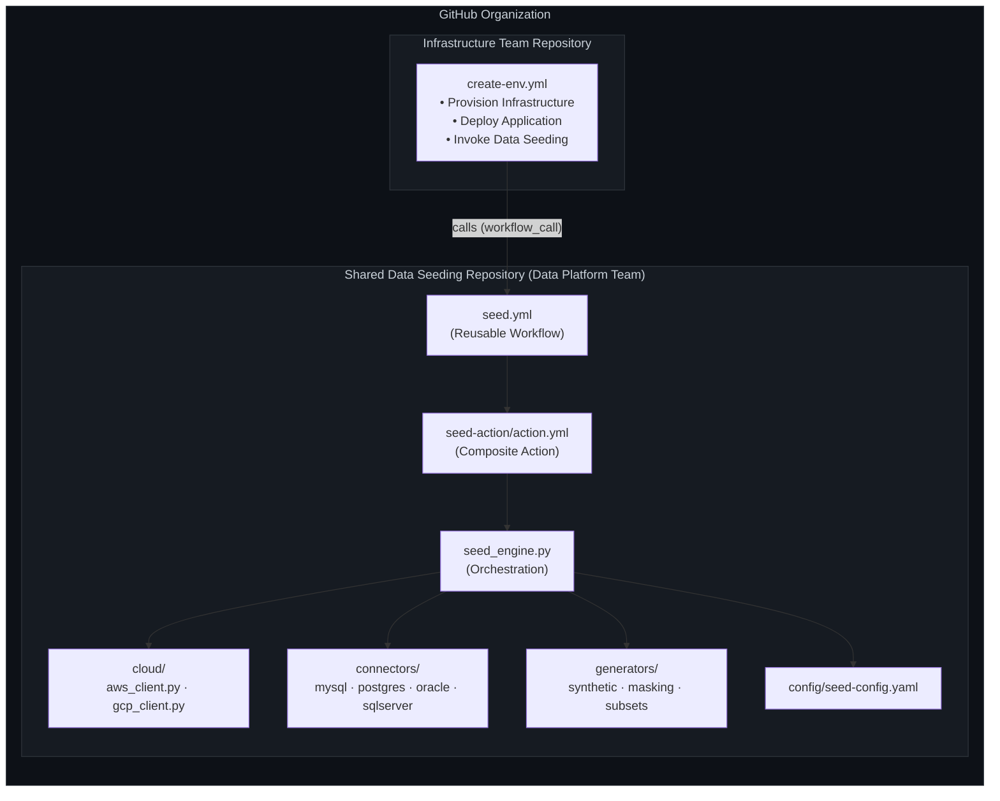
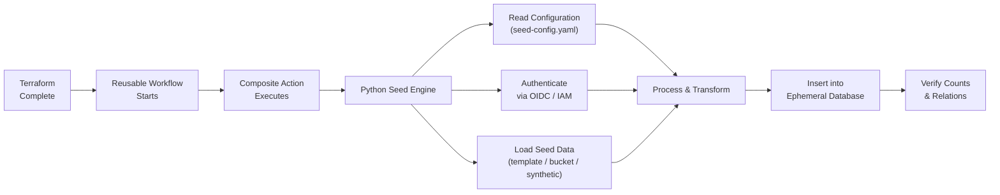
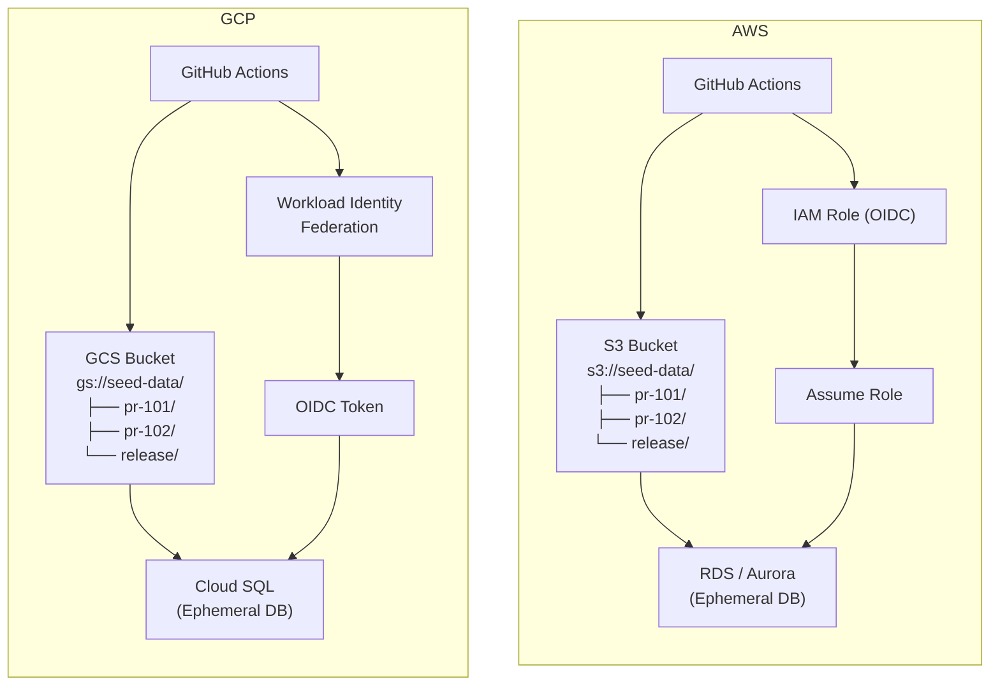

# Enterprise Ephemeral Data Seeding Platform

A reusable, multi-cloud GitHub Actions platform that seeds ephemeral
databases (PR environments, staging, etc.) with template, cloud-stored, or
synthetically generated data — callable by any team's repo via a single
reusable workflow.

---

## Table of Contents

1. [Overview](#overview)
2. [Architecture](#architecture)
3. [Repository Structure](#repository-structure)
4. [Execution Flow](#execution-flow)
5. [Multi-Cloud Runtime](#multi-cloud-runtime)
6. [Supported Database Targets](#supported-database-targets)
7. [Platform Features](#platform-features)
8. [Usage — Infrastructure/Application Teams](#usage--infrastructureapplication-teams)
9. [Usage — Platform Team](#usage--platform-team)
10. [Configuration Reference](#configuration-reference)
11. [Testing Strategy](#testing-strategy)
12. [Security Considerations](#security-considerations)
13. [Monitoring & Observability](#monitoring--observability)
14. [Deployment Strategy](#deployment-strategy)
15. [Contributing](#contributing)

---

## Overview

The platform is owned by the **Data Platform Team** and consumed by any
number of **application/infrastructure teams** through GitHub's reusable
workflows. Each application repo calls a single shared workflow after its
Terraform provisioning step, and the platform takes care of authenticating
to the target cloud, resolving seed data, transforming it, loading it into
the ephemeral database, and verifying the result.

Key properties:

- **Config-driven** — table shape, counts, transformations, and
  verification rules all live in `config/seed-config.yaml`.
- **No long-lived secrets** — cloud access is via OIDC (AWS IAM role
  assumption / GCP Workload Identity Federation).
- **Pluggable everything** — cloud storage backends, database connectors,
  and data sources (template / cloud bucket / synthetic) are all factory
  functions behind small interfaces.

---

## Architecture



### Execution Flow



### Multi-Cloud Runtime



> **Note:** GitHub renders Mermaid diagrams natively. If you're viewing this
> file somewhere that doesn't support Mermaid, the same diagrams are
> described in prose in each linked section below.

---

## Repository Structure

```
shared-data-seeding/
├── .github/
│   └── workflows/
│       └── seed.yml                  # Reusable workflow (entry point)
├── actions/
│   └── seed-action/
│       └── action.yml                # Composite action
├── src/
│   ├── orchestration/
│   │   ├── seed_engine.py            # Main orchestration engine
│   │   └── logging_config.py         # Structured (JSON) logging
│   ├── cloud/
│   │   ├── base.py                   # CloudStorageClient interface
│   │   ├── aws_client.py             # S3 implementation
│   │   ├── gcp_client.py             # GCS implementation
│   │   └── client_factory.py         # get_cloud_client()
│   ├── connectors/
│   │   ├── base.py                   # DatabaseConnector interface
│   │   ├── postgres.py               # PostgreSQL implementation
│   │   ├── mysql.py                  # MySQL implementation
│   │   ├── oracle.py                 # Oracle (interface stub)
│   │   ├── sqlserver.py              # SQL Server (interface stub)
│   │   └── connector_factory.py      # get_db_connector()
│   └── generators/
│       ├── synthetic.py              # Faker-based data generation
│       ├── masking.py                # PII hashing / masking
│       └── subsets.py                # Referentially-consistent sampling
├── config/
│   └── seed-config.yaml              # Tables, transforms, verification
├── seed-data-templates/
│   ├── users.csv
│   ├── products.csv
│   └── orders.csv
├── tests/
│   ├── unit/
│   └── integration/
├── Dockerfile
├── requirements.txt
├── setup.py
├── pytest.ini
├── CHANGELOG.md
└── .gitignore

infra-team-example/                   # Example consumer repo
└── .github/
    └── workflows/
        └── create-env.yml            # Calls seed.yml after Terraform
```

---

## Execution Flow

1. **Terraform completes** in the calling (infrastructure/application) repo,
   producing outputs: database host, port, name, and username.
2. The calling workflow invokes `shared-data-seeding/.github/workflows/seed.yml`
   as a **reusable workflow**, passing those outputs plus cloud provider and
   seed profile.
3. `seed.yml` checks out the shared repo at a **pinned tag** (e.g. `v1.2.0`),
   sets up Python, authenticates to the target cloud via **OIDC** (no static
   secrets), and runs the seed engine.
4. `seed_engine.py`:
   - Loads `config/seed-config.yaml`.
   - Resolves seed data from one of three sources: `template` (bundled CSVs),
     a cloud bucket path (`s3://…` / `gs://…`), or `generate` (synthetic data
     via Faker).
   - Applies configured transformations (hashing/masking PII).
   - Validates records against configured schemas.
   - Truncates and batch-inserts into the target database via the
     appropriate connector (Postgres/MySQL now; Oracle/SQL Server stubbed).
   - Verifies row counts match expectations.
5. Seed logs are uploaded as a workflow artifact for auditability.

---

## Multi-Cloud Runtime

### AWS path
- GitHub Actions assumes an **IAM role via OIDC** — no long-lived AWS keys
  stored in GitHub secrets.
- Seed data is read from **S3** (`s3://seed-data/<environment-id>/`).
- Target database is **RDS or Aurora**.

### GCP path
- GitHub Actions authenticates via **Workload Identity Federation**,
  exchanging a GitHub OIDC token for short-lived GCP credentials.
- Seed data is read from **GCS** (`gs://seed-data/<environment-id>/`).
- Target database is **Cloud SQL**.

Both paths share the same `environment-id`-based bucket layout
(`pr-101/`, `pr-102/`, `release/`, …), so seed data can be organized
consistently regardless of cloud provider.

---

## Supported Database Targets

| Database | Status |
|---|---|
| PostgreSQL | ✅ Implemented (`src/connectors/postgres.py`) |
| MySQL | ✅ Implemented (`src/connectors/mysql.py`) |
| Aurora | ✅ Works via PostgreSQL/MySQL connector (wire-compatible) |
| Cloud SQL | ✅ Works via PostgreSQL/MySQL connector (wire-compatible) |
| Oracle | ⚠️ Interface stub only — implement with `oracledb` |
| SQL Server | ⚠️ Interface stub only — implement with `pyodbc`/`pymssql` |
| MariaDB | ✅ Works via MySQL connector (wire-compatible) |
| On-Prem Databases | ✅ Any target reachable from the runner over the configured host/port |
| Future Connectors | Add a new module under `src/connectors/` implementing `DatabaseConnector` and register it in `connector_factory.py` |

---

## Platform Features

- GitHub Reusable Workflows
- Composite Actions
- Multi-Cloud (AWS & GCP)
- OIDC Authentication (no static secrets)
- Terraform-compatible (consumes Terraform outputs as workflow inputs)
- PR-based ephemeral environments (`pr-<number>` bucket/env convention)
- Config-driven table shape, transforms, and verification
- Extensible database connector interface
- Synthetic data generation (Faker, profile-aware: dev/test/staging)
- Data masking and hashing for PII
- Referentially-consistent subset sampling
- Structured JSON logging + uploaded log artifacts
- Automated unit and integration test suites

---

## Usage — Infrastructure/Application Teams

### 1. Add the seeding call to your workflow

```yaml
# .github/workflows/create-env.yml (your repo)
name: Create Ephemeral Environment

on:
  pull_request:
    types: [opened, synchronize]

jobs:
  create-infrastructure:
    runs-on: ubuntu-latest
    outputs:
      db-host: ${{ steps.terraform.outputs.db-host }}
      db-port: ${{ steps.terraform.outputs.db-port }}
      db-name: ${{ steps.terraform.outputs.db-name }}
      db-username: ${{ steps.terraform.outputs.db-username }}
    steps:
      - uses: actions/checkout@v4
      - name: Terraform Apply
        id: terraform
        run: |
          terraform apply -auto-approve \
            -var="environment_id=${{ github.event.pull_request.number }}"
          echo "db-host=$(terraform output -raw db_host)" >> $GITHUB_OUTPUT
          echo "db-port=$(terraform output -raw db_port)" >> $GITHUB_OUTPUT
          echo "db-name=$(terraform output -raw db_name)" >> $GITHUB_OUTPUT
          echo "db-username=$(terraform output -raw db_username)" >> $GITHUB_OUTPUT

  seed-database:
    needs: create-infrastructure
    uses: your-org/shared-data-seeding/.github/workflows/seed.yml@v1
    with:
      cloud-provider: 'aws'   # or 'gcp'
      environment-id: pr-${{ github.event.pull_request.number }}
      database-host: ${{ needs.create-infrastructure.outputs.db-host }}
      database-port: ${{ needs.create-infrastructure.outputs.db-port }}
      database-name: ${{ needs.create-infrastructure.outputs.db-name }}
      database-username: ${{ needs.create-infrastructure.outputs.db-username }}
      seed-profile: 'test'
    secrets:
      database-password: ${{ secrets.DB_PASSWORD }}
      aws-role-to-assume: ${{ secrets.AWS_ROLE_TO_ASSUME }}
```

### 2. Add required repository secrets

| Secret | Cloud | Purpose |
|---|---|---|
| `DB_PASSWORD` | Both | Database password |
| `AWS_ROLE_TO_ASSUME` | AWS | ARN of an IAM role with S3 read access, trusted for OIDC |
| `GCP_WORKLOAD_IDENTITY_PROVIDER` | GCP | Workload Identity Provider resource name |
| `GCP_SERVICE_ACCOUNT` | GCP | Service account email to impersonate |

---

## Usage — Platform Team

### Publishing a new version

```bash
git add .
git commit -m "feat: add new seed data transformations"
git tag v1.2.0
git push origin main --tags
```

Consumers pin to a tag (`@v1`, `@v1.2.0`) in their `uses:` line, so a new
release never silently breaks existing callers.

### Testing locally

```bash
export CLOUD_PROVIDER=aws
export ENVIRONMENT_ID=pr-123
export DB_HOST=localhost
export DB_PORT=5432
export DB_NAME=test_db
export DB_USER=test_user
export DB_PASSWORD=test_pass

python -m src.orchestration.seed_engine
```

### Running tests

```bash
pip install -r requirements.txt
pytest tests/ -v --cov=src --cov-report=html
```

---

## Configuration Reference

`config/seed-config.yaml` drives table shape, transformations, and
verification:

```yaml
version: "1.0"

storage:
  base_path: "seed-data"
  region: "us-east-1"

batch_size: 1000

tables:
  users:
    count: 100
    order: 1
    fields:
      email: { type: email }
      first_name: { type: string }
      last_name: { type: string }

transformations:
  users:
    - field: email
      operation: hash
    - field: first_name
      operation: mask

validations:
  users:
    required: [email, first_name]
    unique: [email]

verification:
  counts:
    users: 100
    products: 50
    orders: 200
```

Seed profiles (`dev` / `test` / `staging`) scale generated record counts:
`dev` caps at 50 records per table, `test` uses the configured count as-is,
`staging` multiplies the configured count by 10.

---

## Testing Strategy

- **Unit tests** (`tests/unit/`) mock cloud clients and DB connectors to
  test orchestration logic, config validation, and data generation in
  isolation.
- **Integration tests** (`tests/integration/`, marked `@pytest.mark.integration`)
  exercise real S3/GCS access and require live credentials — run these
  separately from the fast unit suite:

```bash
pytest tests/unit -v
pytest tests/integration -v -m integration
pytest -v --cov=src
```

---

## Security Considerations

- **Secrets management** — no hardcoded credentials; GitHub secrets plus
  OIDC-issued short-lived cloud credentials only.
- **Data sensitivity** — never seed real production data into ephemeral
  environments; use the `masking`/`hash` transformations for any PII-like
  fields; define explicit data retention policies for seed buckets.
- **Access control** — scope IAM roles / service accounts to read-only
  access on the seed bucket; use database users with the minimum privileges
  needed to truncate/insert into seed tables only.
- **Audit trail** — every seeding run emits structured JSON logs, uploaded
  as a workflow artifact for later review.

---

## Monitoring & Observability

Example: emitting a custom metric to Datadog at the end of a run.

```yaml
- name: Send metrics to Datadog
  if: always()
  run: |
    curl -X POST "https://api.datadoghq.com/api/v2/series" \
      -H "Content-Type: application/json" \
      -H "DD-API-KEY: ${{ secrets.DD_API_KEY }}" \
      -d '{
        "series": [{
          "metric": "seed.operation.duration",
          "type": 0,
          "unit": "second",
          "interval": 1,
          "points": [{ "timestamp": '"$(date +%s)"', "value": '"$SEED_DURATION"' }]
        }]
      }'
```

A Prometheus-style counter/histogram pair (`seed_operations_total`,
`seed_duration_seconds`) can be exposed the same way if you run the engine
outside GitHub Actions (e.g., in the Docker image on a scheduler).

---

## Deployment Strategy

- **Semantic versioning** — tag releases `vX.Y.Z`; consumers pin to a tag.
- **Blue/green testing** — validate new versions against a sandbox
  environment before repointing `main`-tracking callers.
- **Rollback plan** — because consuming workflows pin to a specific tag,
  rollback is just changing the `ref`/`@vX.Y.Z` in the caller's `uses:` line.

---

## Contributing

### Development setup
1. Clone the repository.
2. Create a virtual environment: `python -m venv venv && source venv/bin/activate`
3. Install dependencies: `pip install -r requirements.txt`

### Adding new seed data
1. Add CSV/JSON files to `seed-data-templates/`.
2. Update `config/seed-config.yaml`.
3. Add tests under `tests/unit/`.
4. Update this document if the schema or behavior changes.

### Release process
1. Bump the version in `setup.py`.
2. Update `CHANGELOG.md`.
3. Open a PR and get review.
4. Merge to `main`.
5. Tag: `git tag vX.Y.Z && git push origin vX.Y.Z`.
6. Create a GitHub Release with release notes.

---

## Summary

This platform provides a complete, production-ready data-seeding framework:
reusable across teams, multi-cloud, OIDC-authenticated, config-driven,
extensible to new database engines, and covered by unit and integration
tests — ready to be wired into any team's ephemeral-environment pipeline.
